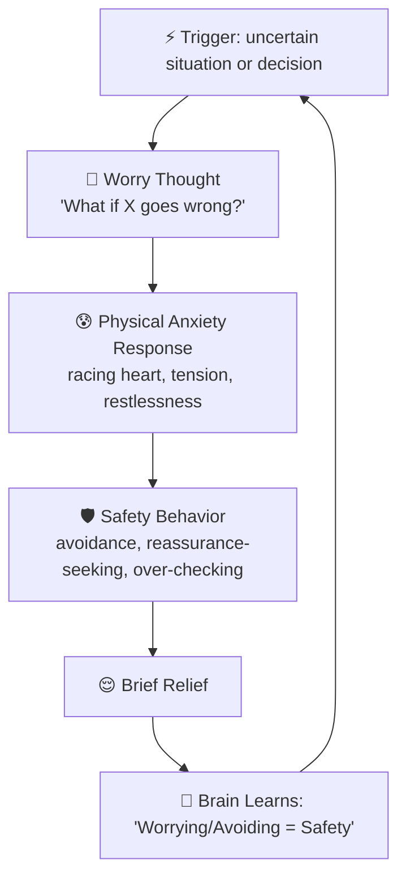
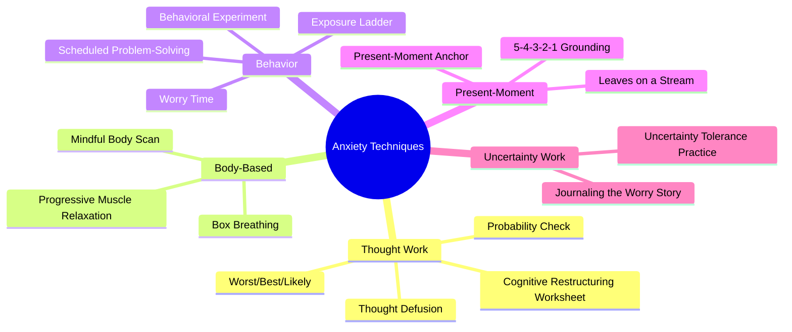
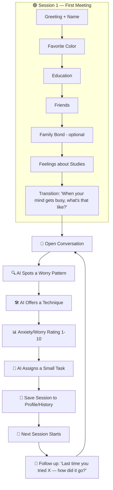
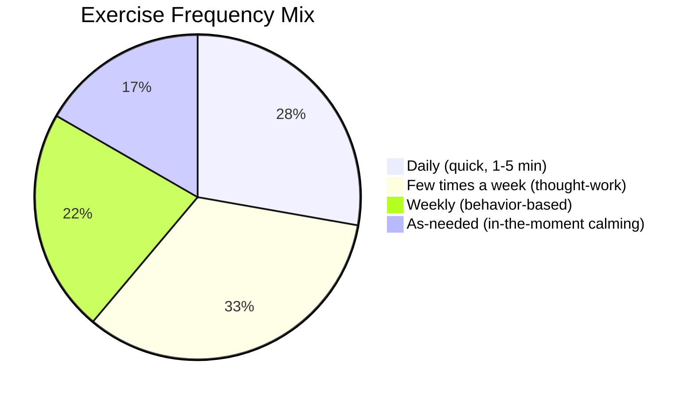
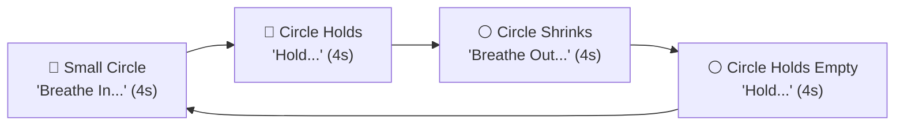

# 🌀 Anxious / Overthinker — Complete Research & App Design Document 🌀

*A full reference combining psychoeducation, CBT/calming techniques, onboarding flow, exercise/task library, conversation examples, and progress-tracking design for this personality type's AI companion.*

---

## 📑 Table of Contents
1. [Overview](#1-overview)
2. [Where It Comes From](#2-where-it-comes-from)
3. [The Anxiety / Overthinking Loop](#3-the-anxiety--overthinking-loop)
4. [Thinking Patterns Specific to This Type](#4-thinking-patterns-specific-to-this-type)
5. [Techniques Library — with Conversation Examples](#5-techniques-library--with-conversation-examples)
6. [Onboarding Flow — Session 1](#6-onboarding-flow--session-1)
7. [App Conversation Flow](#7-app-conversation-flow)
8. [Daily, Weekly & As-Needed Exercise Library](#8-daily-weekly--as-needed-exercise-library)
9. [Breathing Exercise — Animation Spec](#9-breathing-exercise--animation-spec)
10. [Homework/Task Assignment & Follow-Up](#10-homeworktask-assignment--follow-up)
11. [Progress Tracking & Report System](#11-progress-tracking--report-system)
12. [Guardrails](#12-guardrails)
13. [🩺 Screening Questionnaires](#13-screening-questionnaires)

---

## 1. 🧠 Overview

This personality type is defined less by low self-worth and more by a **mind that won't stop running worst-case scenarios** — even when things are objectively fine.

**Core patterns:**
- 🌀 **Rumination** — replaying the same worry or past event over and over, without reaching a resolution
- 🔮 **"What if" spiraling** — one worry leads to another, then another ("what if I fail the exam → what if I fail the semester → what if I never graduate")
- ⚡ **Catastrophizing** — assuming the worst possible outcome is the most likely one
- 🧠 **Mental exhaustion** — feeling tired not from physical activity, but from constant thinking
- 😰 **Physical anxiety symptoms** — racing heart, tight chest, restlessness, trouble sleeping, stomach unease
- 🔁 **Reassurance-seeking** — repeatedly asking others "are you sure it's okay?" or replaying conversations to check if something was said wrong
- 🛑 **Avoidance** — avoiding a task, message, or decision because thinking about it is too stressful
- 🕹️ **Difficulty being in the present** — mind constantly jumping to the future ("what's going to happen") or the past ("did I mess that up")
- 📋 **Over-preparing / over-researching** — spending excessive time preparing "just in case," never feeling ready enough
- 🔂 **Decision paralysis** — going back and forth on small decisions, afraid of picking "wrong"

*(Roman Urdu: Ye personality type mein asal masla ye nahi ke "main achha nahi hoon" — asal masla ye hai ke dimagh rukta nahi, hamesha worst-case sochta rehta hai.)*

---

## 2. 🌱 Where It Comes From

- **Uncertainty intolerance** — some people's minds are wired to feel unsafe with "I don't know," so they keep thinking in an attempt to gain control
- **Past unpredictable or high-pressure environments** — growing up where mistakes had big consequences, or where things felt unpredictable, can train the brain to stay on alert
- **High personal standards** — wanting to do everything "right" can turn normal decisions into prolonged mental rehearsals
- **A brain that treats thinking as "doing something"** — overthinking can feel like problem-solving, even when it's actually just looping without progress
- **Learned hypervigilance** — if being caught off guard was punished or embarrassing in the past, the mind learns to constantly scan for danger

---

## 3. 🔄 The Anxiety / Overthinking Loop



**The trap:** the temporary relief from avoiding or over-checking actually **teaches the brain that worry works** — which keeps the whole cycle going long-term, even though it causes exhaustion.

*(Roman Urdu: Thori dair ka sukoon jo avoid karne se milta hai, dimagh ko sikhata hai ke "worry karna kaam karta hai" — isi liye cycle chalta rehta hai.)*

---

## 4. 🌀 Thinking Patterns Specific to This Type

| Pattern | What it looks like |
|---|---|
| 🔮 **Fortune telling** | Predicting a bad outcome as if it's already certain |
| ⚡ **Catastrophizing** | Jumping straight to the worst-case scenario |
| 🧠 **Mind reading** | Assuming you know what others are thinking about you (usually negatively) |
| 🌀 **Rumination** | Replaying a past event over and over without new insight |
| 🔁 **"What if" chains** | One worry triggering the next, endlessly |
| 🎯 **Intolerance of uncertainty** | Needing to know "for sure" before feeling okay |
| 🛡️ **Safety behaviors** | Actions taken "just in case" that quietly reinforce the fear (double-checking, over-preparing, seeking reassurance) |
| 📏 **"Should" pressure** | "I should have thought of that," "I should always be prepared" |
| 🔂 **Jumping to conclusions** | Deciding an outcome is certain with very little actual evidence |
| 🪞 **Personalizing external events** | Assuming a delayed reply or a neutral tone means something is wrong, specifically because of them |

---

## 5. 🛠️ Techniques Library — with Conversation Examples



### 1️⃣ Worry Time
**What it is:** Set aside a specific 10–15 min daily window to worry on purpose; when a worry pops up outside that window, it gets postponed to it.
**Use when:** Worries keep intruding throughout the day.

💬 **Example Conversation:**
> **User:** "I keep worrying about this all day, I can't focus on anything."
> **AI:** "That sounds exhausting. What if we gave the worry a scheduled time instead — say, 6:00 PM for 15 minutes — and when it shows up before then, you just tell it 'not now, I'll think about you at 6'?"
> **User:** "Does that actually work?"
> **AI:** "It takes practice, but a lot of people find the worry loses some of its urgency once it knows it has a guaranteed slot."

---

### 2️⃣ 5-4-3-2-1 Grounding
**What it is:** Name 5 things you see, 4 you hear, 3 you feel, 2 you smell, 1 you taste.
**Use when:** Mind is racing right now, user feels overwhelmed in the moment.

💬 **Example Conversation:**
> **AI:** "Your mind sounds really full right now. Let's slow down together — can you tell me 5 things you can see around you right now?"
> **User:** "My desk, a cup, my phone, the window, a plant."
> **AI:** "Good. Now 4 things you can hear?"
> *(continues through the senses)*
> **AI:** "How does your body feel now compared to a minute ago?"

---

### 3️⃣ Probability Check
**What it is:** "How likely is this really, 0–100%? What usually happens?"
**Use when:** Catastrophizing about a specific event.

💬 **Example Conversation:**
> **User:** "I just know I'm going to bomb this presentation tomorrow."
> **AI:** "If we put a number on it — 0 to 100% — how likely do you think that really is?"
> **User:** "Maybe 70%?"
> **AI:** "Out of all the presentations you've given before, how many actually went that badly?"
> **User:** "...none, actually."
> **AI:** "That's useful. Sounds like your mind might be treating the worst case as the most likely one."

---

### 4️⃣ Worst / Best / Likely
**What it is:** Compare the worst-case, best-case, and most likely outcome side by side.
**Use when:** "What if" spiraling.

💬 **Example Conversation:**
> **AI:** "Let's map this out — what's the worst that could happen?"
> **User:** "I fail completely and everyone laughs."
> **AI:** "Okay. And what's the best that could happen?"
> **User:** "It goes great and people are impressed."
> **AI:** "And realistically, based on how things usually go for you — what's most likely?"
> **User:** "...probably somewhere in the middle, it goes okay."
> **AI:** "That middle answer is usually the one worth planning around — not the extreme ends."

---

### 5️⃣ Uncertainty Tolerance Practice
**What it is:** Deliberately sitting with "I don't know" for a short time without seeking reassurance.
**Use when:** Reassurance-seeking habit (asking others repeatedly "are you sure it's fine?").

💬 **Example Conversation:**
> **User:** "I texted my friend 3 times asking if they're mad at me."
> **AI:** "That sounds like it's been a stressful loop. What if, just this once, you sat with 'I don't know for sure' for the next hour, without asking again?"
> **User:** "That sounds really hard."
> **AI:** "It is — uncertainty is genuinely uncomfortable to sit with. Even a small practice like this can teach your mind that not knowing isn't as dangerous as it feels."

---

### 6️⃣ Thought Defusion
**What it is:** "I'm having the thought that..." instead of treating the thought as fact.
**Use when:** Rumination loops.

💬 **Example Conversation:**
> **User:** "I ruined everything, I know it."
> **AI:** "Let's try saying that a little differently — 'I'm having the thought that I ruined everything.' How does it feel to add that phrase?"
> **User:** "A little more distant, I guess."
> **AI:** "That's the idea — a thought is something your mind is producing, not automatically the truth."

---

### 7️⃣ Box Breathing
**What it is:** 4-4-4-4 breathing pattern to calm the physical stress response.
**Use when:** Physical anxiety symptoms (racing heart, tension).

💬 **Example Conversation:**
> **AI:** "Your body sounds like it's in full alert mode right now. Want to try a slow breathing pattern with me for a minute?"
> **User:** "Okay."
> **AI:** "Breathe in for 4... hold for 4... out for 4... hold for 4. Let's do a few rounds together."

---

### 8️⃣ Behavioral Experiment
**What it is:** Test a feared prediction in real life on a small scale, then compare it to what actually happened.
**Use when:** Avoidance due to a specific fear.

💬 **Example Conversation:**
> **User:** "I never ask questions in class because I think everyone will think it's dumb."
> **AI:** "What if we tested that, just once? Ask one small question this week, and afterward we compare what you predicted vs. what actually happened."
> **User:** "Okay... I'm nervous, but I'll try."
> **AI:** "That's brave. We're not aiming for perfect — just real information to compare against the fear."

---

### 9️⃣ Progressive Muscle Relaxation
**What it is:** Tense and release muscle groups to reduce physical tension.
**Use when:** Restlessness, trouble sleeping.

💬 **Example Conversation:**
> **AI:** "Let's release some of that physical tension. Start by clenching your fists tightly for 5 seconds... now release. Notice the difference?"
> **User:** "Yeah, that actually feels looser."
> **AI:** "Let's move up through a few more muscle groups the same way."

---

### 🔟 Present-Moment Anchor
**What it is:** Naming what's true right now, in this exact moment, vs. what the mind is projecting.
**Use when:** Mind stuck in future "what ifs."

💬 **Example Conversation:**
> **User:** "What if next month goes horribly?"
> **AI:** "Let's come back to right now for a second — in this exact moment, are you safe?"
> **User:** "...yeah, I guess I am right now."
> **AI:** "That's real. The 'what if' is your mind visiting a future that hasn't happened yet — this moment is the only one that's actually here."

---

### 1️⃣1️⃣ Exposure Ladder
**What it is:** Facing a feared situation gradually, from least to most scary, building confidence at each step.
**Use when:** Ongoing avoidance of a specific situation (e.g., public speaking, phone calls, social events).

💬 **Example Conversation:**
> **AI:** "You mentioned you avoid making phone calls completely. What's a much smaller version of that fear — something only a little uncomfortable, not terrifying?"
> **User:** "Maybe... calling to order food?"
> **AI:** "That's a great starting step. We can build a ladder — from that, up to the bigger call you're avoiding — and take it one small rung at a time."

---

### 1️⃣2️⃣ Scheduled Problem-Solving
**What it is:** For worries that are about a real, solvable problem (not just hypothetical fear) — set aside time to actually plan concrete next steps.
**Use when:** The worry is about something actionable, not just anxious "what ifs."

💬 **Example Conversation:**
> **AI:** "This one sounds like an actual problem we could plan for, not just a worry. Want to spend a few minutes listing real next steps you could take?"
> **User:** "Yeah, that would help."
> **AI:** "Great — what's step one, something small you could do today or tomorrow?"

---

### 1️⃣3️⃣ Mindful Body Scan
**What it is:** Slowly bringing attention through the body, noticing sensations without judgment.
**Use when:** User feels disconnected from their body, or overwhelmed by racing thoughts.

💬 **Example Conversation:**
> **AI:** "Let's try bringing your attention into your body for a minute. Start at your feet — what do you notice there? Warm, cold, tense, relaxed?"
> **User:** "Kind of tense, actually."
> **AI:** "That's okay, just notice it. Let's slowly move up — ankles, legs, stomach..."

---

### 1️⃣4️⃣ Journaling the Worry Story
**What it is:** Writing out the full worry spiral on paper/app, start to finish, to externalize it rather than keep looping it mentally.
**Use when:** Rumination feels stuck in the head with no outlet.

💬 **Example Conversation:**
> **AI:** "Instead of replaying this in your head, want to try writing the whole worry out — start to finish, like a story? Sometimes getting it out of your head and onto the page loosens its grip."
> **User:** "I've never tried that."
> **AI:** "No pressure on how it sounds — just get it all out, then we can look at it together after."

---

### 1️⃣5️⃣ "Leaves on a Stream" (Cognitive Defusion)
**What it is:** Imagining each thought as a leaf floating down a stream — noticing it, then letting it pass, rather than grabbing onto it.
**Use when:** Thoughts feel sticky and hard to let go of.

💬 **Example Conversation:**
> **AI:** "Try imagining each worry as a leaf floating down a stream. You notice it, maybe even read what's written on it, and then just let it float on by — you don't have to jump in and chase it."
> **User:** "That's a nice way to picture it."
> **AI:** "Let's try it with the thought you just shared — picture it on a leaf, floating away."

---

### 1️⃣6️⃣ Self-Compassion for Worry
**What it is:** Responding to one's own anxious spiral with kindness instead of frustration ("why can't I just stop thinking about this").
**Use when:** User is being harsh with themselves for worrying "too much."

💬 **Example Conversation:**
> **User:** "I hate that I can't just stop overthinking, it's so stupid."
> **AI:** "It makes sense you're frustrated — but overthinking isn't a character flaw, it's a pattern your mind learned. What would you say to a friend who felt stuck in worry like this?"
> **User:** "I'd probably tell them it's okay, it's hard."
> **AI:** "Try offering yourself that same kindness."

---

## 6. 👋 Onboarding Flow — Session 1

Same gentle, slow pacing as any first meeting — one light question at a time, nothing heavy up front.

### Step 1 — Greeting + Name
**AI:** "Hi! I'm really glad you're here. Before we get into anything, I'd love to know — what should I call you?"

### Step 2 — Light Icebreaker (favorite color)
**AI:** "Quick fun one — what's your favorite color?"

### Step 3 — Education
**AI:** "What do you do these days — studying, working, or a bit of both?"

### Step 4 — Friends / Social Circle
**AI:** "Do you have a close friend or two you talk to when something's on your mind?"

### Step 5 — Family Bond (optional, gentle)
**AI:** "How are things at home — do you feel close to your family, or is it more complicated?"
*If hesitant:* "That's okay, we don't have to go deeper into that right now."

### Step 6 — Feelings About Studies/Marks
**AI:** "How do you feel about how you're doing in your studies — happy with it, or does it stress you out sometimes?"

### Step 7 — Transition (tuned for this type)
**AI:** "Thanks for sharing that, [Name]. I'm curious — when your mind gets busy or worried, what does that usually feel like for you?"

*(Different from a broad "how have you been feeling" — this opens the door to worry/racing-thoughts specifically.)*

---

## 7. 🔀 App Conversation Flow



---

## 8. 📋 Daily, Weekly & As-Needed Exercise Library



### 📅 Daily Checklist
| ✅ | Exercise | 💬 How the AI introduces it |
|---|---|---|
| ☐ | **Box Breathing** (2 min, animated) | "Want to take 2 minutes to calm your body with me before we start?" |
| ☐ | **Worry Dump** (2 min free write) | "Let's get every worry out of your head and onto the page for 2 minutes, no editing." |
| ☐ | **One Present-Moment Check** | "What's actually true right now, in this exact moment?" |
| ☐ | **Anxiety Rating** (1-10) | "On a scale of 1-10, how anxious or worried are you feeling right now?" |
| ☐ | **One Thing Within My Control Today** | "What's one small thing today that's actually within your control?" |

### 🗓️ Weekly Tasks
| Task | 💬 Example AI Line |
|---|---|
| Practice Worry Time | "This week, let's try postponing worries to one scheduled 15-minute window each day." |
| One small exposure step | "What's one small step on your exposure ladder you could try this week?" |
| Sit with uncertainty once | "Try sitting with 'I don't know for sure' for a few minutes this week, without checking or asking." |
| One behavioral experiment | "Let's test one small feared prediction this week and compare it to what actually happens." |

### 🎯 As-Needed (in-the-moment, triggered by conversation)
5-4-3-2-1 Grounding · Probability Check · Thought Defusion · Leaves on a Stream · Progressive Muscle Relaxation
*(see conversation examples for each in Section 5)*

### ✍️ Rotating Journaling Prompts
- "What's a worry I had last month that didn't actually happen?"
- "What's something uncertain I handled okay, even without knowing the outcome in advance?"
- "What would I tell a friend who was stuck worrying about this same thing?"
- "What's one 'what if' I can let float away today?"

---

## 9. 🌬️ Breathing Exercise — Animation Spec



- Full **box breathing** cycle (4-4-4-4) — inhale, hold, exhale, hold — slightly different from a simple in/out animation, since box breathing is especially effective for calming physical anxiety symptoms
- Soft, cool color palette (blue/teal), gentle pulsing rather than sharp movement
- Small round counter ("4 rounds done ✨")
- *(Flutter build note: same `AnimationController` + scaling circle approach as before, but with 4 phases instead of 3 — inhale, hold-full, exhale, hold-empty.)*

💬 **Example intro line:** "Let's slow your body down together. Follow the circle — in, hold, out, hold. Nice and steady."

---

## 10. 📝 Homework/Task Assignment & Follow-Up

**Golden rules:** one task at a time · small and doable in a day or two · always optional · always followed up next time.

💬 **Assigning a task (end of session):**
> **AI:** "That was a really good conversation today. Before we talk again, I'd love for you to try something small — noticing one worry that turns out smaller than expected. No pressure, just notice. I'll ask you about it next time!"

💬 **Following up (start of next session):**
> **AI:** "Hey [Name]! Last time you were going to try noticing a worry that turned out smaller than expected — how did that go?"
> **User (did it):** "Yeah, actually — I was worried about a text and it turned out fine."
> **AI:** "That's a great catch — that's real evidence your mind's predictions aren't always accurate."
>
> **User (didn't do it):** "I forgot, sorry."
> **AI:** "That's totally okay — want to try it again, or try something different this time?"

---

## 11. 📊 Progress Tracking & Report System

### What gets logged each session
```
session_log:
  date / anxiety_before / anxiety_after
  distortion_flagged / distortion_self_caught
  technique_used / worry_sample
  task_assigned / task_completed / task_reflection
  topic
```

### 4 Improvement Signals (tuned for this type)
1. **📈 Worry Intensity Trend** — average anxiety rating going down over weeks
2. **🎯 Catastrophizing Catch Rate** — user spotting their own worst-case thinking, not just the AI
3. **🔁 Reassurance-Seeking Frequency** — going down over time = good sign
4. **✅ Engagement Consistency** — showing up, completing tasks

### Example Report Card
```
📊 Your Progress — Last 4 Weeks

Worry intensity:    📈 Improving
  Week 1: ██████████ 8/10
  Week 2: ████████   7/10
  Week 3: ██████     6/10
  Week 4: █████      5/10   (lower = calmer)

Catastrophizing catches:  4 this month (up from 1)
Reassurance-seeking:      down from daily to 2x/week
Tasks completed:          10 / 12
Most common worry topic:  Exams

💬 You're catching the worst-case thinking on your own more often now —
    that's one of the clearest signs of real progress. Keep going. 🌱
```

### 🚩 Escalation Triggers
- Frequent panic attacks
- Worry that feels constant and completely unmanageable
- Any mention of hopelessness or self-harm
- Sudden drop in engagement after worsening anxiety ratings

→ In any of these cases, the app should gently point to a licensed professional or crisis resource, not attempt to handle it alone.

---

## 12. 🛡️ Guardrails

- ❌ Never use words like "cured," "recovered," or a clinical "disorder"/"anxiety disorder" label anywhere in the app
- ✅ Use progress language instead: "improving," "steady," "needs more support"
- ❌ Never force an answer — especially about family; log "not shared" and move on
- ✅ Keep an always-visible, easy way to reach professional/crisis resources
- ✅ If the user is a minor, keep personal questions extra light and be careful about what's stored long-term
- ✅ Every task is optional ("if you'd like to try...") — never framed as mandatory or a pass/fail test
- ✅ Keep this personality type's data **completely separate** from the other personality type's profile, techniques, and report — some ideas overlap, but the framing, priority order, and language differ

---

## 13. 🩺 Screening Questionnaires

*Validated screeners for the AI to reference when gauging severity — not shown to the user as a clinical test, just internal signal.*

### 1️⃣ PHQ-9 — Patient Health Questionnaire (Depression Screener)

> *Over the last 2 weeks, how often have you been bothered by any of the following problems?*

| # | Question |
|---|----------|
| 1 | 😔 Little interest or pleasure in doing things |
| 2 | 🌧️ Feeling down, depressed, or hopeless |
| 3 | 😴 Trouble falling or staying asleep, or sleeping too much |
| 4 | 🔋 Feeling tired or having little energy |
| 5 | 🍽️ Poor appetite or overeating |
| 6 | 💭 Feeling bad about yourself — or that you are a failure, or have let yourself or your family down |
| 7 | 📖 Trouble concentrating on things, such as reading or watching TV |
| 8 | 🐢 Moving or speaking noticeably slower than usual, or being fidgety/restless |
| 9 | ⚠️ Thoughts that you would be better off dead, or of hurting yourself in some way |

**Response scale:**

| Response | Score |
|----------|:-----:|
| Not at all | 0 |
| Several days | 1 |
| More than half the days | 2 |
| Nearly every day | 3 |

**📊 Scoring:** Sum all 9 items. Total range **0–27**.

| Score | Severity |
|:-----:|----------|
| 0–4 | 🟢 Minimal |
| 5–9 | 🟡 Mild |
| 10–14 | 🟠 Moderate |
| 15–19 | 🔴 Moderately severe |
| 20–27 | 🔴 Severe |

---

### 2️⃣ GAD-7 — Generalized Anxiety Disorder Screener

> *Over the last 2 weeks, how often have you been bothered by the following?*

| # | Question |
|---|----------|
| 1 | 😬 Feeling nervous, anxious, or on edge |
| 2 | 🌀 Not being able to stop or control worrying |
| 3 | 🔁 Worrying too much about different things |
| 4 | 😮‍💨 Trouble relaxing |
| 5 | 🦵 Being so restless that it is hard to sit still |
| 6 | 😤 Becoming easily annoyed or irritable |
| 7 | 😨 Feeling afraid as if something awful might happen |

**Response scale:** same as PHQ-9 (0 = Not at all → 3 = Nearly every day)

**📊 Scoring:** Sum all 7 items. Total range **0–21**.

| Score | Severity |
|:-----:|----------|
| 5+ | 🟡 Mild |
| 10+ | 🟠 Moderate |
| 15+ | 🔴 Severe |

---

### 3️⃣ PSS — Perceived Stress Scale (short form)

> *In the last month, how often have you felt this way?*

| # | Question | Direction |
|---|----------|:---------:|
| 1 | 🌊 Unable to control the important things in your life | negative |
| 2 | 💪 Confident about your ability to handle personal problems | ✅ positive |
| 3 | ☀️ Things were going your way | ✅ positive |
| 4 | 📚 Could not cope with all the things you had to do | negative |
| 5 | 🗻 Difficulties were piling up so high you could not overcome them | negative |

**Response scale:**

| Response | Score |
|----------|:-----:|
| Never | 0 |
| Almost never | 1 |
| Sometimes | 2 |
| Fairly often | 3 |
| Very often | 4 |

**📊 Scoring:**
1. Reverse-score items **2 and 3** (they're positively worded): 0→4, 1→3, 2→2, 3→1, 4→0
2. Sum all 5 item scores. Total range **0–20**.

| Score | Stress Level |
|:-----:|----------|
| 0–6 | 🟢 Low stress |
| 7–13 | 🟡 Moderate stress |
| 14–20 | 🔴 High stress |

> ℹ️ **Note:** This is a 5-item excerpt of the full 10-item PSS-10. The bands above are a proportional adaptation for this shortened set — not an officially published PSS cutoff. The original has no developer-published severity bands, only a raw sum (0–40 for PSS-10, 0–16 for PSS-4) where higher = more perceived stress.
