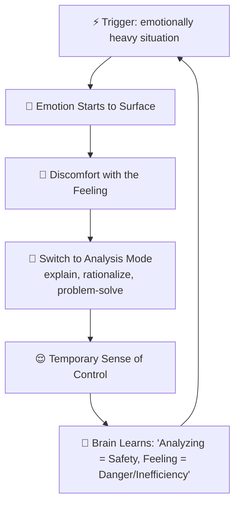
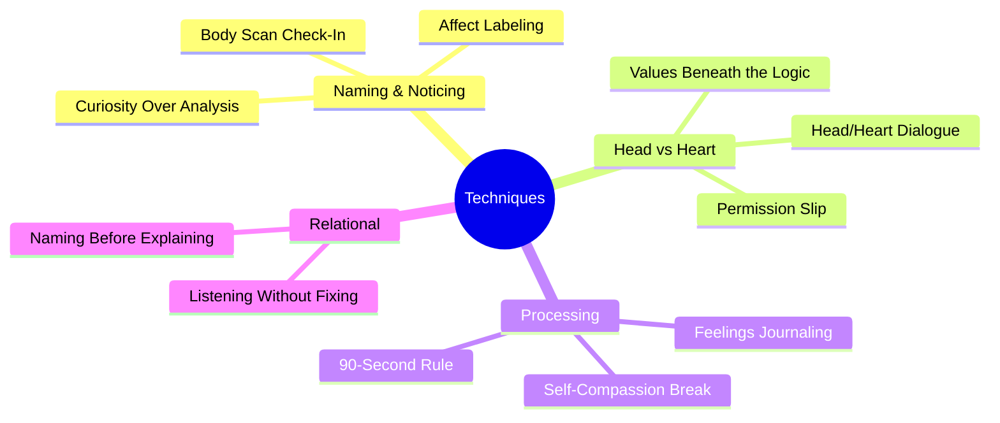
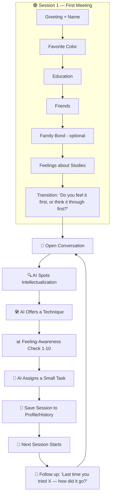
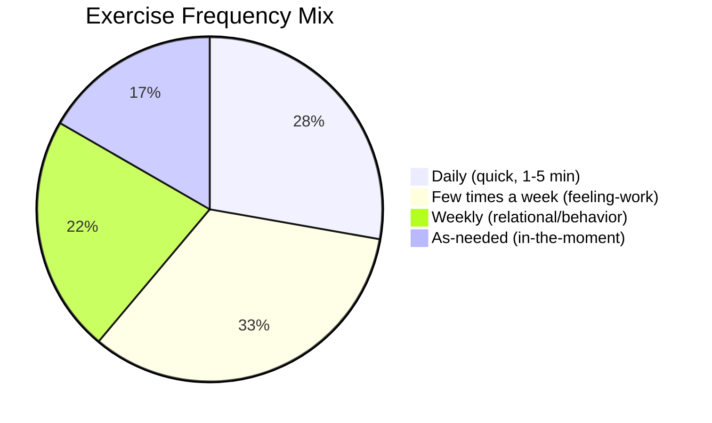
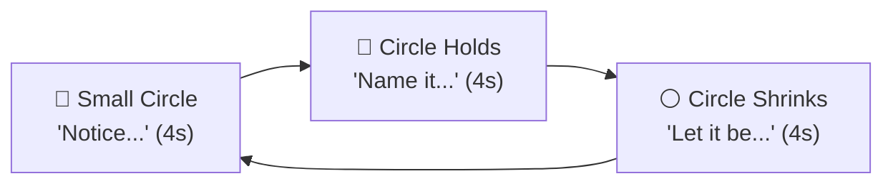

# 🧩 Highly Analytical / Logical — Complete Research & App Design Document 🧩

*A full reference combining psychoeducation, CBT/emotion-focused techniques, onboarding flow, exercise/task library, conversation examples, and progress-tracking design for an AI companion built for this personality type.*

> ⚠️ **Scope note:** This app is a **self-help / psychoeducation companion**, not a licensed therapist. It should never diagnose, claim to "treat" a condition, or replace professional care. When severe distress signals appear, the app should point the user to a professional or crisis resource.

---

## 📑 Table of Contents
1. [Overview](#1-overview)
2. [Where It Comes From](#2-where-it-comes-from)
3. [Signs, Symptoms & Behavior Patterns](#3-signs-symptoms--behavior-patterns)
4. [Thinking Patterns Specific to This Type](#4-thinking-patterns-specific-to-this-type)
5. [The Intellectualization Loop](#5-the-intellectualization-loop)
6. [Techniques Library — with Conversation Examples](#6-techniques-library--with-conversation-examples)
7. [Onboarding Flow — Session 1](#7-onboarding-flow--session-1)
8. [App Conversation Flow](#8-app-conversation-flow)
9. [Daily, Weekly & As-Needed Exercise Library](#9-daily-weekly--as-needed-exercise-library)
10. [Grounding Exercise — Animation Spec](#10-grounding-exercise--animation-spec)
11. [Homework/Task Assignment & Follow-Up](#11-homeworktask-assignment--follow-up)
12. [Progress Tracking & Report System](#12-progress-tracking--report-system)
13. [Safety Guardrails](#13-safety-guardrails)

---

## 1. 🧠 Overview

This personality type isn't defined by low self-worth or racing worry — it's defined by a **mind that reaches for logic the moment something starts to feel heavy**. Emotion gets translated into analysis almost instantly, often before the person even notices they were feeling something.

**Core patterns:**
- 🧩 **Intellectualization** — turning a feeling into a topic to analyze instead of something to feel
- 🧮 **Over-explaining / rationalizing** — building a airtight logical case for a decision instead of naming the emotion behind it
- 🛠️ **"Fix it" reflex** — treating any emotional situation (own or someone else's) as a problem to be solved, not sat with
- 🧊 **Discomfort with vulnerability** — emotion is quietly filed as "inefficient," "irrational," or "not useful"
- 🗣️ **Difficulty naming feelings** — can describe a situation in precise detail, but struggles to say "I feel sad/scared/hurt"
- 🎯 **Control through certainty** — needing a "correct" answer, even for something that isn't actually solvable
- 😐 **Reads as calm, is actually suppressed** — outward composure often masks an emotion that's been analyzed instead of processed
- 🙄 **Dismissing others' emotions** — labeling other people's feelings as "overreacting" or "not logical" when they don't fit a clean explanation

*(Roman Urdu: Is type ka asal pattern ye hai ke jab bhi koi bhari emotion aata hai, dimagh foran usay analyze karna shuru kar deta hai — feel karne se pehle explain karna shuru ho jata hai.)*

---

## 2. 🌱 Where It Comes From

- **Emotion-dismissive environment** — growing up where feelings were met with "stop overreacting" or "just think about it logically" instead of being acknowledged
- **Reward for being "the smart one"** — praise and attention came from being right, capable, or rational — not from being open about feelings
- **High-conflict or unpredictable household** — logic became a safe, controllable refuge when emotions around the person felt chaotic or unsafe
- **Emotional expression once led to punishment or ridicule** — crying, anger, or vulnerability was mocked, minimized, or shut down, so the mind learned to route feeling through analysis instead
- **A brain that treats "solving" as safety** — if a feeling can be explained, it feels contained; if it's just felt, it feels out of control

*(Roman Urdu: Aksar ye pattern bachpan se shuru hota hai — jahan emotions ko serious nahi liya jata tha, sirf "logically socho" kaha jata tha, is liye feeling ko control karne ka tareeqa "explain karna" ban gaya.)*

---

## 3. 🔍 Signs, Symptoms & Behavior Patterns

| Habit | Why it happens |
|---|---|
| 🗂️ **Turning feelings into topics** | "Let me explain why I feel this way" replaces actually feeling it |
| 🛠️ **Jumping to solutions** | Sitting with an unsolved feeling is uncomfortable, so a fix gets offered immediately — to self or others |
| 🧊 **Emotional flatness under pressure** | Outward calm that's really the emotion being routed around, not resolved |
| 🙅 **Deflecting comfort** | When someone tries to comfort them, they redirect to facts or logic ("it's fine, statistically this isn't a big deal") |
| 🗯️ **Debating instead of connecting** | In conflict, focuses on "winning" the logical argument rather than the emotional need underneath it |
| 📚 **Over-researching feelings** | Reads about psychology/emotions extensively but struggles to apply it experientially to themselves |
| 🚪 **Withdrawing when overwhelmed** | Retreats into work, data, or planning rather than reaching out when something hurts |

---

## 4. 🌀 Thinking Patterns Specific to This Type

| Pattern | What it looks like |
|---|---|
| 🧩 **Intellectualization** | Explaining a feeling instead of feeling it ("I'm sad because of X, Y, Z reasons" said in a flat, detached tone) |
| ⚖️ **False dichotomy of logic vs. emotion** | Believing emotion and reason can't both be trusted at once — one must be "wrong" |
| 🎯 **Need for a correct answer** | Treating feelings like a problem with one right solution, instead of something that can just exist |
| 🧮 **Over-justification** | Building a long logical case for a decision that was actually emotional at its core |
| 🙄 **Minimizing others' feelings** | "That doesn't make sense" as a response to someone else's very real emotional reaction |
| 🧊 **Emotional suppression read as strength** | Believing that *not* showing emotion equals being more capable or in control |
| 🔍 **Analysis paralysis on feelings** | Getting stuck dissecting *why* a feeling exists instead of just letting it move through |

---

## 5. 🔄 The Intellectualization Loop



**The trap:** analysis genuinely does bring short-term relief — a feeling that's explained feels more manageable than one that's just felt. But that relief **teaches the brain to skip the feeling step entirely**, which quietly builds up unprocessed emotion over time and can strain close relationships, where people want to feel understood, not just explained to.

*(Roman Urdu: Analysis karne se thori dair ka sukoon milta hai, lekin dimagh ye seekh leta hai ke "feeling ko skip karke seedha explain karna hi safe hai" — is se emotions process nahi hotay, sirf jama hotay rehte hain.)*

---

## 6. 🛠️ Techniques Library — with Conversation Examples



### 1️⃣ Affect Labeling
**What it is:** Naming the feeling in one or two words *before* explaining it — "I feel disappointed" instead of jumping straight to the reasons.
**Use when:** User launches straight into analysis without ever naming an emotion.

💬 **Example Conversation:**
> **User:** "The project got rejected, which honestly makes sense given the timeline constraints and the fact that—"
> **AI:** "Before we get into the reasons — if you had to put one feeling-word on this, what would it be?"
> **User:** "...disappointed, I guess."
> **AI:** "That's worth pausing on for a second. The reasons can wait — disappointed is real too."

---

### 2️⃣ Body Scan Check-In
**What it is:** Noticing where an emotion shows up physically, since logic tends to bypass the body entirely.
**Use when:** User can describe a situation in detail but seems disconnected from how it actually feels.

💬 **Example Conversation:**
> **AI:** "Where do you notice this in your body right now — tight chest, stomach, shoulders, anywhere?"
> **User:** "Huh. I don't really think about that. Maybe... my jaw's kind of tight."
> **AI:** "That's useful information your mind might be skipping past. Just notice it for a second, no need to fix it."

---

### 3️⃣ Curiosity Instead of Analysis
**What it is:** Asking "what is this feeling trying to tell me?" instead of "why am I feeling this?" — curiosity keeps you *with* the feeling, analysis pulls you *out* of it.
**Use when:** User is stuck dissecting a feeling rather than experiencing it.

💬 **Example Conversation:**
> **User:** "I've been trying to figure out the root cause of why I feel off today."
> **AI:** "What if we set the 'why' aside for a second — what does this feeling seem to want, right now?"
> **User:** "...maybe just to be acknowledged, honestly."
> **AI:** "That's a good answer. Sometimes a feeling doesn't need a root cause traced — just a moment of being noticed."

---

### 4️⃣ Head vs. Heart Dialogue
**What it is:** Externalizing the logical voice and the felt sense as two separate "voices" having a conversation, so neither one has to win.
**Use when:** User is stuck in an internal debate, treating logic and emotion as if only one can be right.

💬 **Example Conversation:**
> **AI:** "Let's separate these for a second. What does your 'logical voice' say about this decision?"
> **User:** "That staying is objectively the smarter financial choice."
> **AI:** "Okay. And if your 'gut feeling' got to speak, with no need to justify itself — what would it say?"
> **User:** "...that I'm not happy there anymore."
> **AI:** "Both of those are true at once. Neither one has to cancel the other out."

---

### 5️⃣ Permission Slip
**What it is:** Explicit, stated permission to feel something without needing to justify or explain it first.
**Use when:** User apologizes for or over-explains an emotional reaction.

💬 **Example Conversation:**
> **User:** "Sorry, I know it's silly to be upset about something this small."
> **AI:** "You don't need a reason big enough to justify it. You're allowed to feel upset about it, full stop — no permission slip required."

---

### 6️⃣ Values Beneath the Logic
**What it is:** Tracing a "purely logical" decision back to the emotional value driving it, since most logic is actually in service of something the person cares about.
**Use when:** User presents a decision as 100% rational with no emotional component.

💬 **Example Conversation:**
> **User:** "I turned down the offer. Purely a numbers decision — the salary bump wasn't worth the commute."
> **AI:** "Makes sense on paper. What's the thing you were actually protecting by turning it down — time, energy, something else?"
> **User:** "...probably time with my family, if I'm honest."
> **AI:** "That's not separate from the logic — that's what the logic was quietly built around."

---

### 7️⃣ The 90-Second Rule
**What it is:** Emotions have a natural physiological arc of roughly 90 seconds if the person doesn't feed them with more thought — the discomfort passes faster than the mind expects.
**Use when:** User avoids feeling something because they fear it will be overwhelming or endless.

💬 **Example Conversation:**
> **User:** "If I actually let myself feel this, I don't think I'll be able to stop."
> **AI:** "Feelings are actually shorter-lived than they seem — the physical wave of an emotion often passes in under two minutes if we don't keep re-triggering it by thinking about it. Want to try just sitting with it for one minute and see?"
> **User:** "...okay, I can try that."

---

### 8️⃣ Feelings Journaling (Not Facts Journaling)
**What it is:** Journaling that stays in feeling-language ("I felt small") rather than sliding into situation-summary or analysis ("here's what happened and why").
**Use when:** User's journaling or self-reflection tends to read like a report.

💬 **Example Conversation:**
> **AI:** "Try journaling just the feeling-words tonight — no backstory, no reasons, just what you felt. See how short that list actually is."
> **User:** "That feels weirdly harder than writing the whole story."
> **AI:** "That's exactly why it's worth practicing."

---

### 9️⃣ Listening Without Fixing
**What it is:** Practicing sitting with someone else's (or your own) feeling without immediately offering a solution or logical reframe.
**Use when:** User describes jumping to "fix" a friend's or partner's emotional moment instead of just listening.

💬 **Example Conversation:**
> **User:** "My partner was upset and I gave them three solid reasons it wasn't a big deal. They got more upset."
> **AI:** "What do you think they needed in that moment — a solution, or to feel heard first?"
> **User:** "...probably to feel heard. I skipped straight to fixing it."
> **AI:** "That's a really common pattern for logical thinkers — next time, try just reflecting the feeling back before offering anything else."

---

### 🔟 Self-Compassion Break
**What it is:** Responding to your own emotional avoidance with warmth instead of self-criticism for "not being logical enough" about your own feelings.
**Use when:** User is frustrated with themselves for having an emotional reaction at all.

💬 **Example Conversation:**
> **User:** "I hate that this is even bothering me, it's not rational."
> **AI:** "Feelings don't have to be rational to be valid. What would you say to a friend who felt this way?"
> **User:** "I'd probably tell them it's okay to feel however they feel."
> **AI:** "Try offering yourself that same understanding."

---

## 7. 👋 Onboarding Flow — Session 1

Same gentle, slow pacing as any first meeting — one light question at a time, nothing heavy up front.

### Step 1 — Greeting + Name
**AI:** "Hi! I'm really glad you're here. Before we get into anything, I'd love to know — what should I call you?"

### Step 2 — Light Icebreaker (favorite color)
**AI:** "Quick fun one — what's your favorite color?"

### Step 3 — Education
**AI:** "What do you do these days — studying, working, or a bit of both?"

### Step 4 — Friends / Social Circle
**AI:** "Do you have a close friend or two you talk to when something's on your mind?"

### Step 5 — Family Bond (optional, gentle)
**AI:** "How are things at home — do you feel close to your family, or is it more complicated?"
*If hesitant:* "That's okay, we don't have to go deeper into that right now."

### Step 6 — Feelings About Studies/Marks
**AI:** "How do you feel about how you're doing in your studies — happy with it, or does it stress you out sometimes?"

### Step 7 — Transition (tuned for this type)
**AI:** "Thanks for sharing that, [Name]. I'm curious — when something upsets you, do you tend to feel it right away, or do you find yourself thinking it through first?"

*(Different from a broad "how have you been feeling" — this opens the door to naming the analyze-before-feel pattern specifically, without labeling it yet.)*

---

## 8. 🔀 App Conversation Flow



---

## 9. 📋 Daily, Weekly & As-Needed Exercise Library



### 📅 Daily Checklist
| ✅ | Exercise | 💬 How the AI introduces it |
|---|---|---|
| ☐ | **One-Word Feeling Check** (before any explaining) | "Before we talk about why — one word, how do you feel right now?" |
| ☐ | **Body Scan Check-In** | "Quick check — is there any tension anywhere in your body right now?" |
| ☐ | **Feeling-Awareness Rating** (1-10) | "On a scale of 1-10, how connected do you feel to your emotions today?" |
| ☐ | **One Thing I Felt (Not Thought)** | "What's one thing you *felt* today — not thought, felt?" |
| ☐ | **Pause Before Fixing** | "Did anyone share a feeling with you today? Did you fix it, or just sit with it first?" |

### 🗓️ Weekly Tasks
| Task | 💬 Example AI Line |
|---|---|
| Practice naming before explaining | "This week, try naming the feeling-word out loud before explaining the reasons — even just to yourself." |
| Listen without fixing once | "Try listening to someone's feelings this week without offering a solution, even if you have one." |
| Sit with an unsolved feeling | "Pick one small feeling this week and just let it be there for a few minutes, without needing to resolve it." |
| Share a feeling first, reasons after | "Next time you explain a decision to someone, try leading with the feeling, then the logic." |

### 🎯 As-Needed (in-the-moment, triggered by conversation)
Affect Labeling · Body Scan Check-In · Curiosity Instead of Analysis · 90-Second Rule · Permission Slip
*(see conversation examples for each in Section 6)*

### ✍️ Rotating Journaling Prompts
- "What's a feeling I explained away this week instead of just feeling it?"
- "What would it look like to trust a feeling without needing proof it's 'valid'?"
- "When did logic help me, and when did it maybe get in the way?"
- "What's one feeling I had today that I haven't said out loud yet?"

---

## 10. 🌬️ Grounding Exercise — Animation Spec



- A slower, quieter animation than a breathing exercise — the emphasis is on *noticing* and *naming*, not physical calming alone
- Soft, neutral color palette (sage/slate/warm grey) — deliberately calm and non-clinical, matching this type's comfort with steadiness
- Small prompt rotates through the 3 phases: "Notice → Name it → Let it be"
- *(Flutter build note: same `AnimationController` + scaling circle approach as the breathing exercises in other personas, but paired with rotating text prompts instead of a strict timed breath count.)*

💬 **Example intro line:** "Let's slow down for a second — not to fix anything, just to notice. Follow the circle: notice, name it, let it be."

---

## 11. 📝 Homework/Task Assignment & Follow-Up

**Golden rules:** one task at a time · small and doable in a day or two · always optional · always followed up next time.

💬 **Assigning a task (end of session):**
> **AI:** "That was a really good conversation today. Before we talk again, I'd love for you to try something small — the next time you feel something, try naming it in one word before you explain it to yourself. No pressure, just notice. I'll ask you about it next time!"

💬 **Following up (start of next session):**
> **AI:** "Hey [Name]! Last time you were going to try naming a feeling before explaining it — how did that go?"
> **User (did it):** "Yeah, actually — I caught myself mid-explanation once and just said 'annoyed' instead."
> **AI:** "That's a real shift — noticing the pattern in the moment is exactly the skill we're building."
>
> **User (didn't do it):** "I forgot, sorry."
> **AI:** "That's totally okay — want to try it again, or try something different this time?"

---

## 12. 📊 Progress Tracking & Report System

### What gets logged each session
```
session_log:
  date / feeling_awareness_before / feeling_awareness_after
  intellectualization_flagged / intellectualization_self_caught
  technique_used / feeling_word_used
  task_assigned / task_completed / task_reflection
  topic
```

### 4 Improvement Signals (tuned for this type)
1. **📈 Feeling-Awareness Trend** — average self-rated emotional connection going up over weeks
2. **🎯 Self-Catch Rate** — user noticing their own shift into analysis mode, not just the AI
3. **🗣️ Language Shift** — explanation-first language ("because X, Y, Z...") → feeling-first language ("I feel... because...")
4. **✅ Engagement Consistency** — showing up, completing tasks

### Example Report Card
```
📊 Your Progress — Last 4 Weeks

Feeling-awareness:  📈 Improving
  Week 1: ████       4/10
  Week 2: ██████     6/10
  Week 3: ███████    7/10
  Week 4: ████████   8/10   (higher = more connected)

Self-catches:             5 this month (up from 1)
Feeling-first language:   used 6 times (up from 0)
Tasks completed:          9 / 12
Most common topic:        Work decisions

💬 You're leading with the feeling more often before explaining it —
    that's one of the clearest signs of real progress. Keep going. 🌱
```

### 🚩 Escalation Triggers
- Complete emotional shutdown/numbness lasting multiple sessions
- Any mention of hopelessness or self-harm
- Sudden drop in engagement after a heavier emotional topic
- Relationship strain repeatedly described as "they say I never listen/feel anything"

→ In any of these cases, the app should gently point to a licensed professional or crisis resource, not attempt to handle it alone.

---

## 13. 🛡️ Safety Guardrails

- ❌ Never use words like "cured," "recovered," or a clinical "disorder" label anywhere in the app
- ✅ Use progress language instead: "improving," "steady," "needs more support"
- ❌ Never force an answer — especially about family; log "not shared" and move on
- ✅ Keep an always-visible, easy way to reach professional/crisis resources
- ✅ If the user is a minor, keep personal questions extra light and be careful about what's stored long-term
- ✅ Every task is optional ("if you'd like to try...") — never framed as mandatory or a pass/fail test
- ✅ Never frame logic/analysis itself as "bad" — the goal is adding feeling alongside it, not replacing one with the other
- ✅ Keep this personality type's data **completely separate** from the other personality types' profiles, techniques, and reports — some ideas overlap, but the framing, priority order, and language differ
