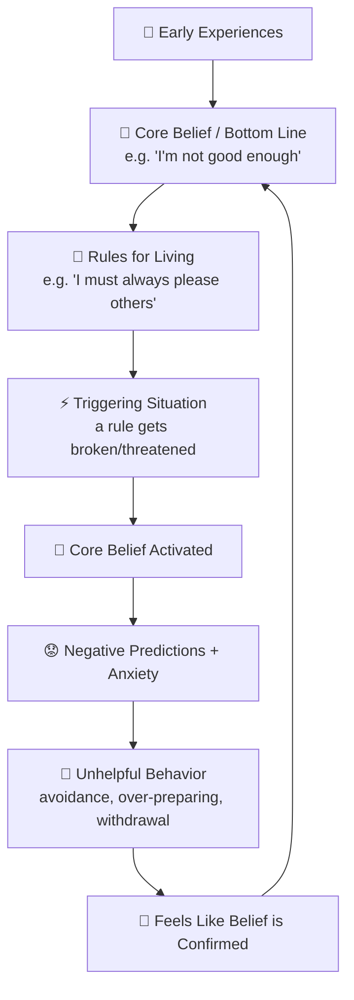
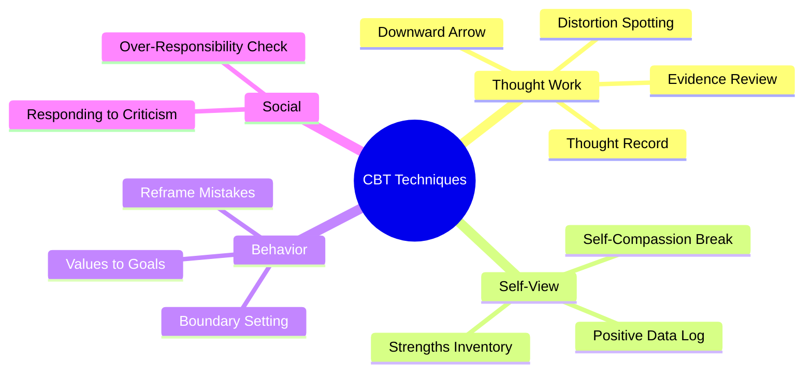
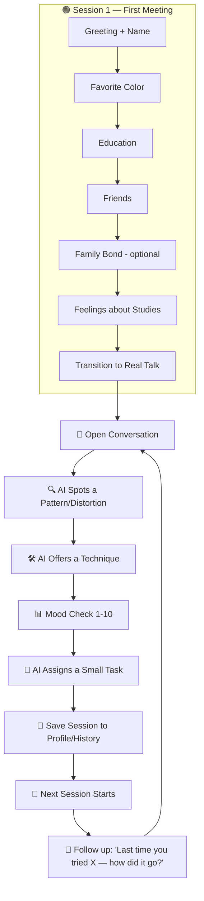
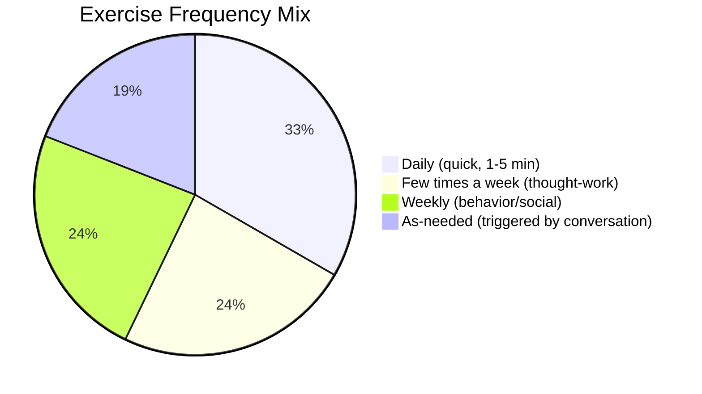
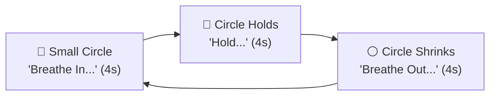

# 🌸 Low Self-Esteem — Complete Research & App Design Document 🌸

*A full reference combining psychoeducation, CBT techniques, onboarding flow, exercise/task library, conversation examples, and progress-tracking design for an AI-powered self-esteem support companion.*

> ⚠️ **Scope note:** This app is a **self-help / psychoeducation companion**, not a licensed therapist. It should never diagnose, claim to "treat" a condition, or replace professional care. When severe distress signals appear, the app should point the user to a professional or crisis resource.

---

## 📑 Table of Contents
1. [Overview](#1-overview)
2. [Causes & Origins](#2-causes--origins)
3. [Signs, Symptoms & Behavior Patterns](#3-signs-symptoms--behavior-patterns)
4. [Cognitive Distortions](#4-cognitive-distortions)
5. [The Self-Esteem Maintenance Loop](#5-the-self-esteem-maintenance-loop)
6. [CBT Techniques Library — with Conversation Examples](#6-cbt-techniques-library--with-conversation-examples)
7. [Onboarding Flow — Session 1](#7-onboarding-flow--session-1)
8. [App Conversation Flow](#8-app-conversation-flow)
9. [Daily, Weekly & As-Needed Exercise Library — with Conversation Examples](#9-daily-weekly--as-needed-exercise-library--with-conversation-examples)
10. [Breathing Exercise — Animation Spec](#10-breathing-exercise--animation-spec)
11. [Homework/Task Assignment & Follow-Up](#11-homeworktask-assignment--follow-up)
12. [Progress Tracking & Report System](#12-progress-tracking--report-system)
13. [Safety Guardrails](#13-safety-guardrails)

---

## 1. 🧠 Overview

Low self-esteem is how a person judges their own worth — when that judgment is consistently harsh, it shapes mood, relationships, and daily choices. It can feel tiring, because the mind keeps making anxious predictions about the future, and it can lower mood because of how much blame a person takes on whenever something goes wrong.

**Core patterns:**
- 🧠 **Self-critical thinking** — quickly blaming oneself when something goes wrong
- 😟 **Anxious predictions** — expecting negative outcomes before they happen
- 🏷️ **Rigid self-labels** — "I'm stupid," "I'm unlovable," "I'm a failure"
- 📉 **Discounting the positive** — good outcomes credited to luck or outside factors instead of one's own ability
- 🙅 **Difficulty accepting compliments** — praise feels untrue, or contradicts the inner sense of unworthiness
- 🔁 **Negative outcomes as "proof"** — any bad moment gets read as confirmation of being incapable

*(Roman Urdu: Kam self-esteem matlab khud ke bare mein sakht judgment — jab kuch bura ho to khud ko blame karna, achi baaton ko luck samajhna, aur tareef sun kar bhi uncomfortable feel karna.)*

---

## 2. 🌱 Causes & Origins

Low self-esteem usually develops from repeated experiences rather than appearing randomly:

| Source | Example |
|---|---|
| 👶 Childhood/adolescent experience | Critical parent, harsh teacher, conditional approval |
| 💔 Relationship breakdowns | Repeated loss of connection without support to process it |
| 📉 Repeated setbacks | School, work, or relationship failures without guidance |
| 🎭 "Conditions of worth" | Learning early that love/approval depended on behaving a certain way |

These experiences crystallize into a **core belief** ("I'm not good enough," "I'm unlovable," "I'm a failure"), which then gets protected and reinforced by unhelpful **rules for living** ("I must always please others," "I should never ask for help").

*(Roman Urdu: Ye baatein bachpan ya kisi mushkil waqt se shuru hoti hain, aur waqt ke sath ek "core belief" ban jati hai jo har cheez ko us belief ke through dekhti hai.)*

---

## 3. 🔍 Signs, Symptoms & Behavior Patterns

| Habit | Why it happens |
|---|---|
| 🕒 **Procrastination** | Delaying tasks protects self-worth — a bad outcome can be blamed on "not enough time" instead of ability |
| 😶 **Passivity** | Belief that goals are unreachable saps the motivation to even try |
| 🚪 **Isolation** | Fear of being a burden or "unworthy of love" leads to withdrawal — which then feeds more negative thinking |
| 🙋 **People-pleasing** | Saying yes to everyone becomes a way to earn validation and acceptance |
| 💯 **Perfectionism** | Overworking is used to "prove" worth and hide a feared sense of inadequacy |
| 🗯️ **Harsh self-talk** | Internal criticism becomes the default narrator, wearing down mood over time |
| 🙅 **Can't accept compliments** | Self-perceived worthlessness contradicts positive feedback, so it feels false |

---

## 4. 🌀 Cognitive Distortions

These are the specific "thinking traps" that keep the self-esteem loop running:

| Distortion | What it looks like |
|---|---|
| 🔍 **Magnification/exaggeration** | Blowing a small mistake up into a huge deal |
| ⚫⚪ **All-or-nothing thinking** | "Always" / "never" — no middle ground |
| 🔁 **Overgeneralization** | One bad event → "this always happens to me" |
| 🕶️ **Mental filter** | Only noticing the negative, filtering out anything positive |
| ❤️‍🔥 **Emotional reasoning** | "I feel scared, so it must be dangerous" |
| 👤 **Personalization & blame** | Taking full responsibility for things only partly (or not at all) within one's control |
| 🏷️ **Global labeling** | "I'm an idiot" instead of "that was a mistake" |
| 📸 **Availability bias** | Overweighting a vivid, recent, or scary memory over the full picture |
| 📏 **"Shoulds"** | Rigid self-imposed rules that create pressure and guilt when unmet |

---

## 5. 🔄 The Self-Esteem Maintenance Loop

*(Based on Melanie Fennell's CBT formulation model)*



**The takeaway:** the loop is self-reinforcing — which is exactly why gentle, *repeated* CBT practice (not one conversation) is what breaks it.

*(Roman Urdu: Ye loop apne aap ko baar baar confirm karta rehta hai — is liye ek hi baat cheet se farq nahi parta, roz thora thora practice zaroori hai.)*

---

## 6. 🛠️ CBT Techniques Library — with Conversation Examples



### 1️⃣ Positive Data Logging
**What it is:** Noting down small proofs of good qualities the user already has.
**Use when:** User is being very self-critical.

💬 **Example Conversation:**
> **AI:** "You mentioned you feel like you never do anything right. Can I ask — was there any small moment today, even tiny, where you helped someone or handled something well?"
> **User:** "I guess... I helped my friend carry her bags at the station."
> **AI:** "That counts! That's kindness in action. Let's remember that — it's proof against 'I never do anything right.'"

---

### 2️⃣ Boundary Setting
**What it is:** Small practice of saying no / protecting personal time.
**Use when:** User always says yes to everyone, never to themselves.

💬 **Example Conversation:**
> **AI:** "It sounds like you say yes to almost everyone's requests. What would it feel like to say no, just once, this week?"
> **User:** "Scary, honestly. I don't want to disappoint anyone."
> **AI:** "That's a really honest answer. How about starting really small — even protecting 15 minutes just for yourself, no explanations needed?"

---

### 3️⃣ Thought → Behavior → Outcome Mapping
**What it is:** Tracing one moment's chain: thought → feeling → action → result.
**Use when:** User describes a specific hard moment (e.g., before an interview).

💬 **Example Conversation:**
> **AI:** "Before the interview, what went through your mind?"
> **User:** "I thought, 'I'm useless, I'll never get this job, why even try.'"
> **AI:** "And after that thought — how did you feel, and what did you end up doing?"
> **User:** "I felt hopeless, and I almost didn't go."
> **AI:** "So that one thought nearly changed your whole action. That's worth noticing — the thought isn't just a feeling, it's steering your behavior."

---

### 4️⃣ Downward Arrow Technique
**What it is:** Repeatedly asking "if that's true, what would it mean?" to trace a worry to its core belief.
**Use when:** A surface worry seems to hide something deeper.

💬 **Example Conversation:**
> **AI:** "You said you're scared of messing up this report. If you did mess it up, what would that mean?"
> **User:** "That I'm bad at my job."
> **AI:** "And if you were bad at your job, what would that mean about you?"
> **User:** "...that I'm just not good enough, in general."
> **AI:** "There it is — that's the real belief underneath. That's what we can gently work on."

---

### 5️⃣ Cognitive Distortion Check
**What it is:** Naming the specific thinking trap in the moment.
**Use when:** Words like "always," "never," "everyone," "no one" appear.

💬 **Example Conversation:**
> **User:** "I always mess everything up."
> **AI:** "I noticed the word 'always' there. Has there been even one time recently where something went okay?"
> **User:** "...I guess my presentation last week went fine."
> **AI:** "Exactly — so maybe it's not 'always.' Sounds like this might be what's called all-or-nothing thinking."

---

### 6️⃣ Evidence Review
**What it is:** Looking at the real facts of a situation instead of just the feeling.
**Use when:** A negative belief is being treated as fact without evidence.

💬 **Example Conversation:**
> **AI:** "You said 'no one likes me.' What's the evidence for that — and is there any evidence against it?"
> **User:** "Well... my roommate does invite me places a lot."
> **AI:** "That's real evidence against it. It's easy for our minds to only remember the painful moments and skip the good ones."

---

### 7️⃣ Self-Compassion Exercise
**What it is:** Kind self-talk — "What would you tell a friend?"
**Use when:** User is being very hard on themselves.

💬 **Example Conversation:**
> **AI:** "If your best friend made this same mistake, what would you say to them?"
> **User:** "I'd tell them it's okay, everyone messes up sometimes."
> **AI:** "That's beautiful — now try saying that exact thing to yourself."

---

### 8️⃣ Strengths Inventory
**What it is:** A list of personal strengths, including small/less obvious ones.
**Use when:** Session start, or whenever the user feels low.

💬 **Example Conversation:**
> **AI:** "Let's do something different for a second — can you name one thing, even small, that you're good at?"
> **User:** "I don't know... maybe I'm a good listener?"
> **AI:** "That's a real strength, and not a small one — a lot of people struggle to truly listen."

---

### 9️⃣ Values → Goals → Plan
**What it is:** Defining what matters, then breaking it into small steps.
**Use when:** User feels lost or directionless.

💬 **Example Conversation:**
> **AI:** "If your life felt really meaningful a year from now, what would be different?"
> **User:** "I'd probably have finished my degree and made new friends."
> **AI:** "Great — what's one small step this week toward either of those?"

---

### 🔟 Reframe Mistakes
**What it is:** Turning "I'm a screw-up" into "I made a mistake, here's what I can learn."
**Use when:** Any time a mistake comes up.

💬 **Example Conversation:**
> **User:** "I'm such an idiot, I forgot the deadline."
> **AI:** "That sounds frustrating. Would it feel more accurate to say 'I made a mistake with the deadline' instead of 'I'm an idiot'? Those are two very different things."

---

### 1️⃣1️⃣ Responding to Criticism
**What it is:** Pausing, taking what's useful, and letting go of the rest.
**Use when:** User is spiraling over someone's feedback.

💬 **Example Conversation:**
> **User:** "My coworker called me a 'bulldozer' and now I can't stop thinking I'm a bad person."
> **AI:** "That word can be read a few ways — powerful and efficient, or harsh. Before deciding it means something bad about you, what's one other way it could've been meant?"

---

### 1️⃣2️⃣ Over-Responsibility Check
**What it is:** Separating what's truly the user's fault from what isn't.
**Use when:** User is blaming themselves for something with many contributing causes.

💬 **Example Conversation:**
> **AI:** "You said this whole outcome is your fault. Walking through it — what parts were actually within your control, and what parts weren't?"
> **User:** "I guess the other person's choices weren't up to me..."
> **AI:** "Exactly — you can hold your part responsibly, without carrying all of it."

---

## 7. 👋 Onboarding Flow — Session 1

> **Golden rule:** Never start with a heavy question. Build trust with light topics first, then move toward anything personal — one question at a time, always optional.

### Step 1 — Greeting + Name
**AI:** "Hi! I'm really glad you're here. Before we get into anything, I'd love to know — what should I call you?"
*(Roman Urdu: "Hi! Mujhe khushi hai aap yahan hain. Bataiye — main aap ko kya bulaun?")*

### Step 2 — Light Icebreaker (favorite color)
**AI:** "Quick fun one — what's your favorite color?"
*(Roman Urdu: "Ek chota sa mazaydar sawal — aap ka favorite color kya hai?")*

### Step 3 — Education
**AI:** "What do you do these days — studying, working, or a bit of both?"
*(Roman Urdu: "Aap aajkal kya kar rahe hain — parhai, job, ya dono?")*

### Step 4 — Friends / Social Circle
**AI:** "Do you have a close friend or two you talk to when something's on your mind?"
*(Roman Urdu: "Koi close dost hai jis se dil ki baat share kar sakte hain?")*

### Step 5 — Family Bond (optional, gentle)
**AI:** "How are things at home — do you feel close to your family, or is it more complicated?"
*If hesitant:* "That's okay, we don't have to go deeper into that right now."

### Step 6 — Feelings About Studies/Marks
**AI:** "How do you feel about how you're doing in your studies — happy with it, or does it stress you out sometimes?"

### Step 7 — Transition to Real Conversation
**AI:** "Thanks for sharing all that with me, [Name]. I'd love to know a little more about you — how have you been feeling lately, in general?"

---

## 8. 🔀 App Conversation Flow



---

## 9. 📋 Daily, Weekly & As-Needed Exercise Library — with Conversation Examples



### 📅 Daily Checklist
| ✅ | Exercise | 💬 How the AI introduces it |
|---|---|---|
| ☐ | **Breathing Exercise** (2 min, animated) | "Want to take 2 minutes to just breathe with me before we start?" |
| ☐ | **One Positive Thing Today** | "What's one small good thing that happened today — even tiny counts?" |
| ☐ | **One Kind Thing I Did** | "Did you do or say anything kind today, even small?" |
| ☐ | **Self-Talk Check** | "Did you say anything harsh about yourself today? What could you say instead?" |
| ☐ | **Mood Rating** | "On a scale of 1-10, how are you feeling right now?" |

### 🗓️ Weekly Tasks
| Task | 💬 Example AI Line |
|---|---|
| Say no once | "This week, try saying no to one small request — just to notice how it feels." |
| Reach out to a friend | "Could you message or call someone this week, even briefly?" |
| One goal step | "What's one tiny step you could take this week toward something that matters to you?" |
| Accept a compliment | "Next time someone compliments you, try just saying 'thank you' — no deflecting." |
| Protect 30 minutes for myself | "Can you carve out 30 minutes this week with zero obligations, just for you?" |

### 🎯 As-Needed (triggered by conversation)
Thought Record · Distortion Spotter · Downward Arrow · Evidence Review · Reframe a Mistake · Self-Compassion Break
*(see conversation examples for each in Section 6)*

### ✍️ Rotating Journaling Prompts
- "What's one thing I'm good at, even a small thing?"
- "When did I feel proud of myself recently?"
- "What would I say to a friend who felt the way I feel right now?"
- "What's one 'should' I'm holding onto that I could let go of?"
- "What's a mistake I made that I've learned from?"

---

## 10. 🌬️ Breathing Exercise — Animation Spec



- Circle **grows** during inhale, **holds still**, then **shrinks** during exhale (box breathing: 4-4-4, or 4-7-8 pattern)
- Soft color palette (blue/lavender/green), optional calm background tone
- Small round counter ("3 rounds done ✨") for visible progress
- *(Flutter build note: fits naturally as an `AnimationController` scaling a `Container`/`CustomPainter` circle, synced to a `Timer` per breathing phase.)*

💬 **Example intro line:** "Let's take a moment to breathe together. Just follow the circle — in as it grows, hold, and out as it shrinks. No rush."

---

## 11. 📝 Homework/Task Assignment & Follow-Up

**Golden rules:** one task at a time · small and doable in a day or two · always optional · always followed up next time · never a pass/fail test.

💬 **Assigning a task (end of session):**
> **AI:** "That was a really good conversation today. Before we talk again, I'd love for you to try something small — noticing one moment where you handled something well. No pressure at all, just notice how it feels. I'll ask you about it next time!"

💬 **Following up (start of next session):**
> **AI:** "Hey [Name]! Last time you were going to try noticing one good moment — how did that go?"
> **User (did it):** "Yeah, I noticed I helped a classmate with notes."
> **AI:** "That's wonderful — how did it feel to notice that about yourself?"
>
> **User (didn't do it):** "I forgot, sorry."
> **AI:** "That's totally okay — some weeks are just busier than others. Want to try it again, or try something different this time?"

---

## 12. 📊 Progress Tracking & Report System

### What gets logged each session
```
session_log:
  date / mood_before / mood_after
  distortion_flagged / distortion_self_caught
  technique_used / self_talk_sample
  task_assigned / task_completed / task_reflection
  topic
```

### 4 Improvement Signals
1. **📈 Mood Trend** — average distress score going down over weeks
2. **🎯 Self-Catch Rate** — user spotting their own distortions, not just the AI
3. **🗣️ Language Shift** — global labels ("I'm useless") → specific language ("I made a mistake")
4. **✅ Engagement Consistency** — showing up, completing tasks

### Example Report Card
```
📊 Your Progress — Last 4 Weeks

Mood trend:        📈 Improving
  Week 1: ██████████ 8/10
  Week 2: ████████   7/10
  Week 3: ██████     6/10
  Week 4: █████      5/10   (lower = calmer)

Self-catches:        3 this month (up from 0)
Self-talk shift:     "I'm useless" → "I made a mistake"  (4 times)
Tasks completed:      9 / 12
Most common topic:    Exam stress

💬 You're catching negative thoughts on your own now —
    that's one of the biggest signs of real progress. Keep going. 🌱
```

### 🚩 Escalation Triggers
- High distress (8–9/10) for multiple sessions in a row
- Mentions of hopelessness or self-harm
- Sudden drop in engagement after worsening mood
- No improvement in self-catch rate after many weeks

→ In any of these cases, the app should gently point to a licensed professional or crisis resource, not attempt to handle it alone.

---

## 13. 🛡️ Safety Guardrails

- ❌ Never use words like "cured," "recovered," or a clinical "disorder" label anywhere in the app
- ✅ Use progress language instead: "improving," "steady," "needs more support"
- ❌ Never force an answer — especially about family; log "not shared" and move on
- ✅ Keep an always-visible, easy way to reach professional/crisis resources
- ✅ If the user is a minor, keep personal questions extra light and be careful about what's stored long-term
- ✅ Every task is optional ("if you'd like to try...") — never framed as mandatory or a pass/fail test
- ✅ The AI's tone throughout: warm, patient, curious — never clinical, robotic, or judgmental

---

*🌸 This document combines: psychoeducation research, the CBT technique library with real conversation examples, the full onboarding flow, the exercise/task system, homework follow-up, and the progress-report design — everything needed to build the AI self-esteem companion in one place. 🌸*
