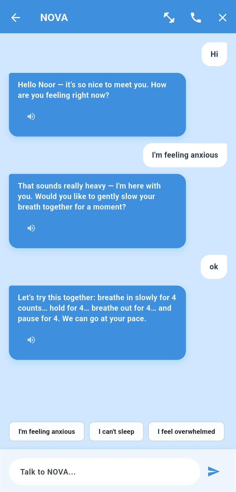
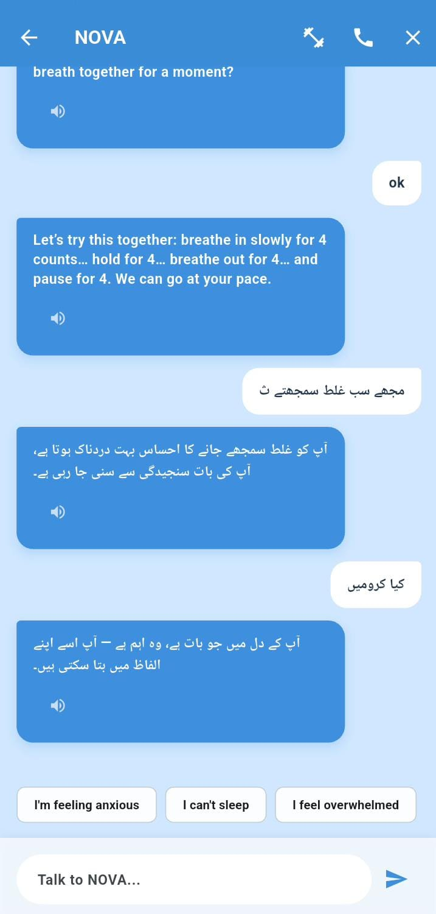
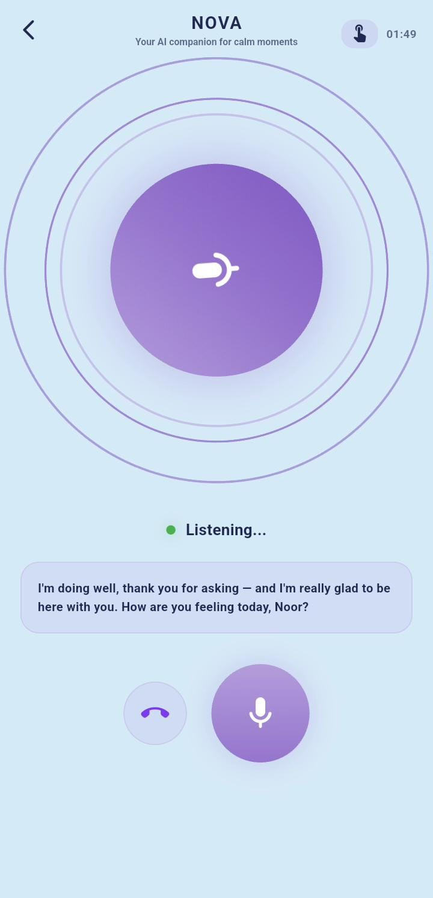
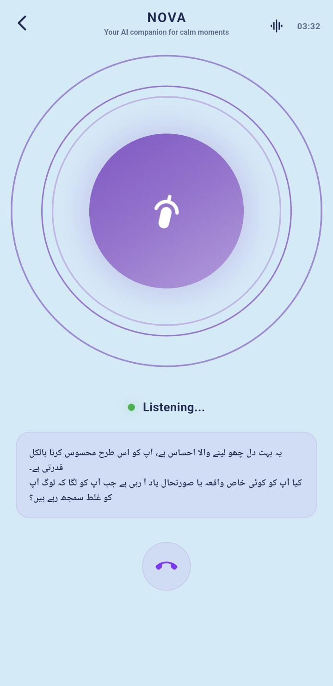
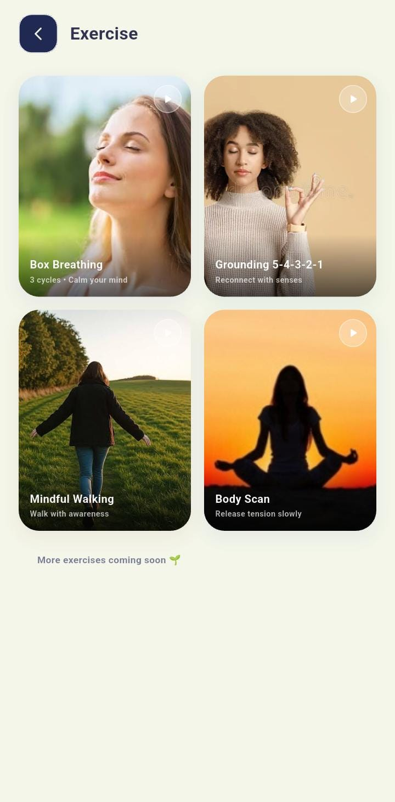
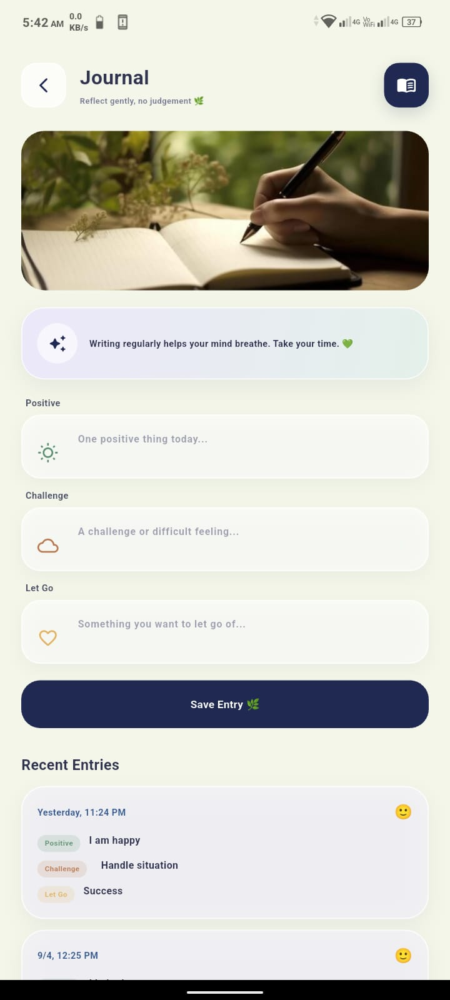
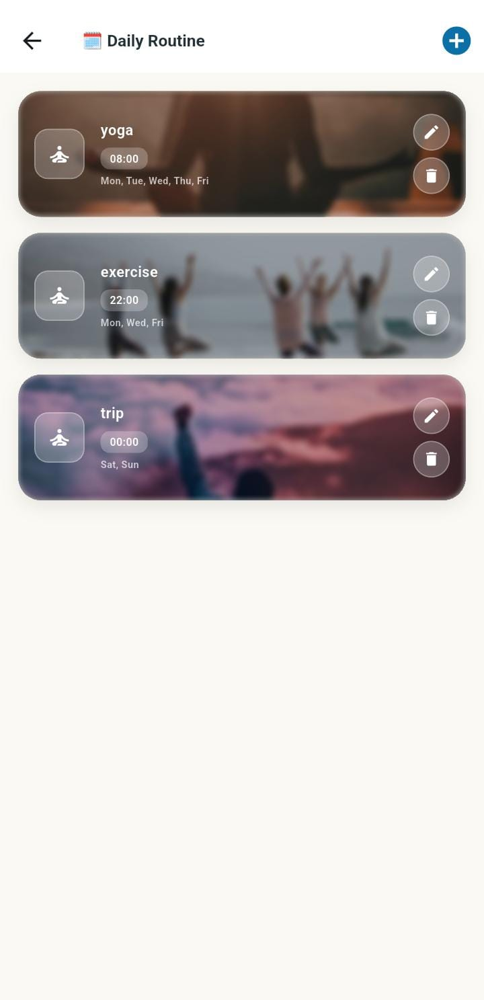
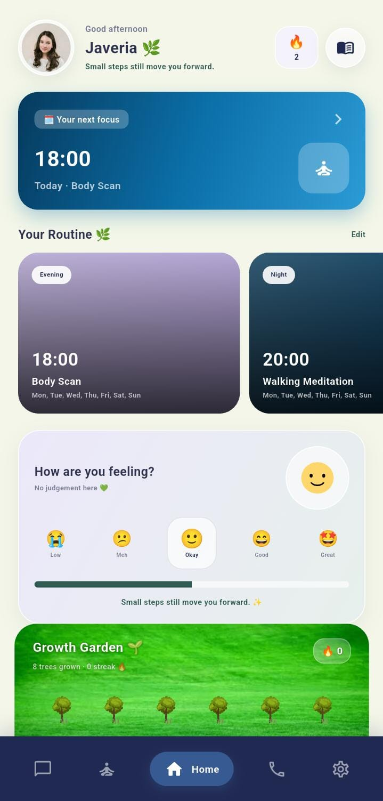
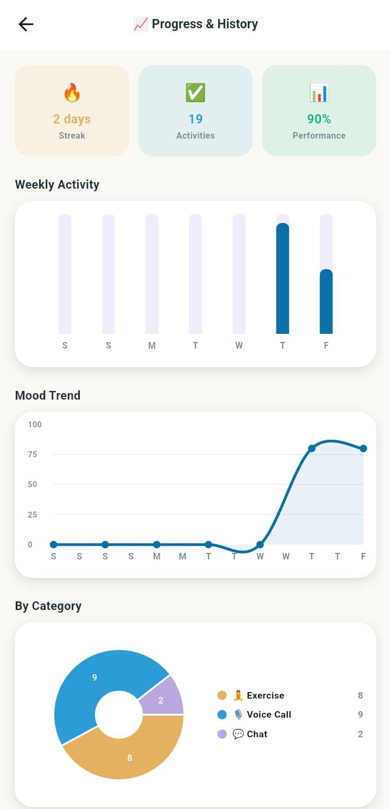

# PeaceMind AI 🌿

> *"Your space, your pace. Small steps are still progress."*


![Javeria Usmani (Team Leader) ] 
![Mahnoor Naeem (Developer) ] ![ Momina Munir (Developer) ] ![Qudsia Imtiaz (Developer) ]

**AI-powered mental wellness companion.** Mental First Aid — not therapy, not a medical device, never diagnoses.

---

## Problem Statement

Millions struggle with stress, anxiety, and burnout every day — yet never seek traditional therapy. The barriers are systemic and deeply personal:

- **Stigma** — "What will people think if I see a therapist?"
- **Cost** — therapy is unaffordable for most students and low-income users.
- **Privacy** — fear of being judged, exposed, or labeled by others.
- **Access** — long waitlists and a severe shortage of mental health professionals, especially across South Asia.

PeaceMind AI exists to close that gap. It is a private, always-available companion that meets users where they are — on their phone, in their own language, without judgment — and takes the first step with them when they would otherwise take none.

---

## Target Users

- **Students and young professionals** dealing with academic pressure, imposter syndrome, and early-career burnout.
- **Anyone feeling stressed, anxious, or overwhelmed** who needs support in the moment — not weeks from now on a waitlist.
- **South Asian users** who want mental wellness support in **Urdu** or **English**, without the cultural friction of Western-centric therapy apps.
- **People who want help but will never visit a therapist** — due to stigma, privacy concerns, or simply not feeling "sick enough" to justify it.

---

## Core Features

### 1. NOVA Chat




Natural AI conversation — no forms, no questionnaires, no clinical intake. Just talk.

- **Hidden distress detection**: every AI reply carries a hidden `[DISTRESS_SCORE: 0.0–1.0]` tag. Distress is detected from the conversation itself — the user is never asked "how are you feeling on a scale of 1–10."
- **Inline exercise popup**: when distress exceeds **0.7**, NOVA suggests a relevant exercise mid-conversation. The popup includes a 3-minute cooldown to prevent over-triggering, and the user can decline at any time.
- **Urdu replies auto-spoken via TTS**: when the user speaks Urdu, NOVA's reply is automatically spoken aloud using the `[SPEAK:true]` tag — no tap required.
- **English replies are text-only**: the manual play button appears for English responses, giving users control over audio playback.
- **Session summary on end**: when a chat session concludes, NOVA generates a summary that is saved to Firestore history — building a record of progress over time.

---

### 2. NOVA Voice Call




Continuous hands-free voice conversation with NOVA — like a real phone call with an AI companion that listens, understands, and responds in real time.

- **Continuous VAD (Voice Activity Detection)**: the microphone stays open by default. NOVA auto-listens after each pause and restarts listening after it finishes speaking — no push-to-talk required (tap-to-speak is available as an opt-in toggle).
- **Full speech pipeline**: Speech → STT (speech-to-text) → language auto-detection → AI reply generation → TTS (text-to-speech) in the user's detected language.
- **Crisis keyword detection**: 12 hard-coded unsafe phrases (self-harm, suicide ideation, hopelessness) are evaluated *before* the AI is ever called. These patterns **cannot be prompt-injected** — they bypass the model entirely and trigger an immediate safety response.
- **Crisis trigger response**: calming visual overlay + grounding voice message + `safetyFlag: true` written permanently to Firestore — alerting future sessions to provide extra care.
- **Full transcript saved**: every voice call transcript is stored in Firestore for replay and review after the call ends.

---

### 3. Guided Exercises



Four fully animated, CBT-based exercises — each with step-by-step narration, a synced progress timer, and an immersive visual stage. Completion is only recorded when the exercise **fully finishes** — never on open, never on abandon.

| Exercise | Technique | Animation |
|---|---|---|
| **Box Breathing** | 4-4-4-4 inhale-hold-exhale-hold cycles | Expanding/contracting ring synchronized to breath count |
| **Grounding 5-4-3-2-1** | Sensory awareness across five senses | Sense orbs, ripple effects, and floating motes per stage |
| **Body Scan** | Progressive body awareness from head to toe | Body-node glow animation traveling across a body silhouette |
| **Mindful Walking** | Attentive walking meditation | Animated path with footstep markers and ambient scene |

Each exercise ends with a **completion overlay** showing time spent, cycles completed, calm/focus scores, and garden progress gained.

---

### 4. Journaling



Three gentle, non-confrontational prompts designed to build reflective habits without pressure:

- **Positive** — something good that happened today.
- **Challenge** — something difficult you faced.
- **Let Go** — something you want to release.

Entries are saved to both **SharedPreferences** (instant local access) and **Firestore** (`users/{uid}/journal`) for cloud persistence. Saving a journal entry also marks the daily journal task complete and contributes to **Garden growth**.

---

### 5. Daily Routine



Auto-generates a fresh set of **exactly 5 tasks per day**: 4 exercises + 1 journal entry. Designed to give users a small, achievable structure every morning — not an overwhelming to-do list.

- Regenerates on local date change — no server clock dependency.
- Actively avoids repeating yesterday's exact task set, keeping the routine feeling fresh.
- Tasks are completable directly from the home screen cards or the routine screen.

---

### 6. Garden (Gamification)



The Garden replaces a meaningless login streak with a **visual growth system driven only by real task completion**. Meaningless taps do not count.

- **12-slot visual garden** displayed on the home screen.
- **Exercise completed** (all steps finished in the player) → **+1 tree**
- **Journal entry saved** → **+1 tree**
- **Full garden (12 trees)** → `gardenStreak++` and all slots reset to 0 — marking one completed "garden cycle," not a daily login.
- **NOT a login streak**: opening the app without doing anything earns nothing.
- **Persistence**: SharedPreferences for instant local reads; Firestore (`users/{uid}/garden`) for cloud backup. Merge strategy: **cloud wins if greater** — safe for offline use and multi-device sync.

---

### 7. Progress Reports



All charts and metrics are powered by **real session data only** — no fake or placeholder entries. If you haven't used the app, the report is honestly empty.

- **Weekly activity bar chart** — sessions completed per day across the past week.
- **Mood-trend line chart** — emotional trajectory over time, derived from distress scores.
- **Category pie chart** — breakdown of activity by type (exercises, calls, chat, journal).
- **Streak and performance summary cards** — garden cycles completed, total trees grown, session counts.
- **Filterable session list** — All / Tasks / Exercises / Calls / Chat — with timestamps and summaries.

---

## AI Model Used

| Field | Detail |
|---|---|
| **Provider** | [OpenRouter](https://openrouter.ai) |
| **Model** | `qwen/qwen-plus` (Alibaba Cloud — Qwen family) |
| **Chat path** | Model hardcoded in `services/api_chat_service.dart` |
| **Voice path** | Model loaded from `.env` → `OPENROUTER_MODEL` |
| **Conversation approach** | CBT-based (Cognitive Behavioral Therapy) |

Every AI reply is parsed for hidden control tags:

| Tag | Purpose |
|---|---|
| `[DISTRESS_SCORE: X.X]` | Triggers an inline exercise popup when score exceeds 0.7 |
| `[SUGGESTED_EXERCISE: id]` | Identifies which exercise to suggest in the popup |
| `[SPEAK: true/false]` | Auto-speaks the reply via TTS for Urdu; silent for English |

**Cross-session memory**: at the end of each session, a summary and durable user facts are written to `users/{uid}/memory/userFacts` in Firestore. These are read before every subsequent AI call — in both chat and voice — so NOVA never re-asks what it already knows.

---

## Language Support

Language detection is handled by `services/language_detection_service.dart` — the same service drives both chat and voice paths. Detection runs **per message** (chat) and **per utterance** (voice), not per session.

| Input | Detected As | NOVA Replies In | Voice Output |
|---|---|---|---|
| Urdu script (ا ب پ …) | `ur` | Urdu — simple, respectful, 1–3 sentences | Auto-spoken (`ur-PK`) |
| English | `en` | English | Spoken (`en-US` / `en-IN`) |
| Roman Urdu ("aap kaise hain") | `en` / `hinglish` | English | Spoken |
| Mixed Urdu + English | Urdu wins | Urdu | Auto-spoken |

> **Note:** Hindi and Punjabi are **not supported**. Both system prompts explicitly instruct the model: *"NEVER use Hindi or Devanagari script."* Hindi input is force-detected as English and replied to in English only.

---

## Functional Requirements

1. User must be able to register and log in via email/password authentication.
2. NOVA must respond to text input using natural, conversational dialogue — no clinical forms.
3. NOVA must support continuous voice calls with live STT and TTS in the user's language.
4. App must detect emotional distress from conversation content without asking the user directly.
5. App must trigger an inline exercise popup when the distress score exceeds **0.7**.
6. App must detect crisis keywords and activate the safety flow immediately — bypassing the AI entirely.
7. Each exercise must record completion **only** when all steps are fully finished — never on open.
8. Journal entries must save to both local storage (SharedPreferences) and Firestore for cloud persistence.
9. Daily routine must auto-generate exactly **5 unique tasks per day** and refresh on date change.
10. Garden must grow only on genuine task completion — no taps, no logins, no shortcuts.
11. Progress reports must display only real session data — no placeholder or fabricated entries.
12. App must detect the user's language per message (chat) and per utterance (voice) automatically.
13. Cross-session memory must persist between chat and voice sessions so NOVA retains context over time.

---

## Non-Functional Requirements

1. **Privacy** — all user data stored under `users/{uid}`; accounts are fully isolated with no shared data.
2. **Availability** — AI companion accessible 24/7 with no appointment or waitlist.
3. **Safety** — crisis keyword detection is hard-coded (12 patterns) and cannot be bypassed by prompt injection.
4. **Performance** — TTS and STT must respond without noticeable lag during voice calls.
5. **Offline resilience** — SharedPreferences provides instant local reads; Firestore syncs when the connection returns.
6. **Security** — API keys stored in `.env` and excluded from version control via `.gitignore`.
7. **Scalability** — Firestore collection architecture supports per-user growth without schema changes.
8. **Ethics** — the app never diagnoses, never labels, and never shames the user under any circumstance.
9. **Language accuracy** — language detection runs per message, not per session, to handle multilingual users correctly.
10. **Data integrity** — garden tree counts and streak values use a cloud-wins merge strategy to prevent data loss on offline usage.

---

## Database Structure (Firestore)

### Collection Paths

| Path | Stores |
|---|---|
| `users/{uid}/session/{sessionId}/messages` | Chat messages grouped by session |
| `users/{uid}/chatMessages` | Voice call turn-by-turn messages |
| `users/{uid}/sessionSummaries` | AI-generated end-of-session summaries |
| `users/{uid}/audioCallSessions` | Full voice call transcripts |
| `users/{uid}/memory/userFacts` | Durable facts NOVA remembers about the user |
| `users/{uid}/journal` | Journal entries |
| `users/{uid}/garden` | Garden state (`treeCount`, `totalTrees`, `gardenStreak`) |

### Safety Flag

On any crisis keyword detection, a permanent flag is written:

```
users/{uid} → safetyFlag: true
```

This flag is **never deleted** — it persists across all future sessions to ensure NOVA provides consistently careful support.

### Local Storage (SharedPreferences)

- Onboarding completion flag (per account)
- Garden state (instant access before Firestore syncs)
- Daily routine date and task set
- Per-user cached data using `uid`-prefixed keys

---

## Technical Architecture

| Layer | Technology | Location |
|---|---|---|
| Framework | Flutter, Dart SDK ^3.11, Material 3 | `pubspec.yaml`, `main.dart` |
| State management | Provider (`ChangeNotifier`), 7 providers | `lib/providers/*` |
| Auth + DB | Firebase Auth + Cloud Firestore | `firebase_options.dart`, `services/` |
| Local storage | SharedPreferences | All providers and services |
| AI — Chat | OpenRouter REST, `qwen/qwen-plus` | `services/api_chat_service.dart` |
| AI — Voice | OpenRouter REST, `qwen/qwen-plus` | `services/audio_call_service.dart` |
| STT | `speech_to_text` plugin | `services/speech_to_text_service.dart` |
| TTS | `flutter_tts` (on-device voices) | `services/speech_to_text_service.dart` |
| Charts | `fl_chart` | `screens/history_screen.dart` |
| Animations | Lottie + `AnimationController` | `assets/animations/`, `lib/widgets/stage/` |
| Config | `flutter_dotenv` (`.env` file) | `.env`, `main.dart` |

> **Note:** `.env` contains `TTS_MODEL` and `YOUR_VOICE_API_KEY` fields, but no code reads them yet. Current TTS uses on-device `flutter_tts` voices. Cloud TTS integration is planned for a future release.

---

## App Flow

```
main.dart → AuthGate
 ├── Not logged in           → AuthScreen
 │                              
 ├── Logged in, no onboard   → OnboardingScreen  (runs once per account)
 └── Logged in + onboarded   → HomeScreen
                              
       ├── Chat Screen        → NOVA text chat
       │                        
       │     └── Switch to Voice Call
       │                          
       ├── Voice Call Screen  → NOVA hands-free voice call
       ├── Exercise Screen    → Exercise catalog
       │                       
       │     └── Exercise Player Screen
       ├── Routine Screen     → Daily 5 tasks
       │                       
       │     └── Exercise Player Screen
       ├── Journal Screen     → 3-prompt journaling
       │                       
       ├── Settings Screen
       │                         
       │     └── History / Reports Screen
       │                          
       └── Home routine cards → Exercise Player Screen
```

**Session rule:** Logged-in users return directly to the Home screen on app restart. Logout is available only via Settings — there is no other way to end a session.

---

## App Structure

```
PeaceMind-AI/
├── .env                          # API keys — never commit
├── firebase.json
├── pubspec.yaml
├── assets/
│   ├── animations/               # Lottie files (garden_tree_static.json, mood lotties)
│   ├── audio/                    # yappy.mp3
│   ├── images/                   # splash.png, exercise covers, home backgrounds
│   └── screenshots/              # signup.jpeg, signin.jpeg, home.jpeg, exercise.jpeg,
│                                   setting.jpeg, report.jpeg, journal.jpeg, routine.jpeg,
│                                   chat1.jpeg, chat2.jpeg, call1.jpeg, call2.jpeg
└── lib/
    ├── main.dart                 # Entry: dotenv + Firebase init + MultiProvider + AuthGate
    ├── firebase_options.dart
    ├── data/                     # Exercise step scripts and registry
    ├── logic/                    # Audio call session state machine
    ├── models/                   # user, routine, history, journal, exercise, call session
    ├── providers/                # auth, chat, audio_call, routine, daily_routine,
    │                             # journal, garden
    ├── screens/                  # All app screens
    ├── services/                 # All backend + AI + language + TTS/STT services
    ├── theme/app_theme.dart
    └── widgets/                  # Garden widget, exercise popup, audio call UI,
                                  # panic overlay, stage/ (4 animated exercise stages)
```

---

## Business Model (Planned — Not Yet in Code)

> ⚠️ **Not yet enforced in code.** There is currently no tier, quota, or session-counter logic anywhere in the app. Every user has full access. The table below is the target model for future implementation.

| Tier | Duration | Chat Sessions | Call Sessions | Extras |
|---|---|---|---|---|
| **Free** | 1 month | 30 | 15 | — |
| **Basic** | 2 months | 60 | 35 | — |
| **Premium** | 5 months | Unlimited | Unlimited | Real psychiatrist booking |

**Note:** The crisis safety flow **always bypasses session limits** — no exceptions. A user in crisis will never be told "you've used your quota."

---

## Future Targets

- In-app AI disclosure banner — *"I am an AI and may make mistakes"*
- One-tap emergency helpline screen with local numbers
- Real doctor / psychiatrist booking flow (Premium tier)
- Flagged-issue tiering: trauma, eating disorders, substance use → **coping-only mode** with mandatory referral to a real professional
- Cloud TTS integration — replace on-device `flutter_tts` voices with high-quality API-based voices
- Session quota enforcement per tier with upgrade prompts at limits
- Data-usage explanation screen — transparent disclosure of what is stored and why
- Clinical review and CBT certification from a qualified mental health professional
- iOS App Store and Google Play Store release

---

## Safety & Ethics

### Currently Implemented

- **Never diagnoses** — both the chat and voice system prompts explicitly instruct the model: *"Never assume or diagnose any mental health condition."*
- **Never reveals distress scores** — `[DISTRESS_SCORE: X.X]` is an internal tag. The user never sees it and is never told they are being scored.
- **Hard-coded crisis detection** — 12 keyword patterns (self-harm, suicide ideation, hopelessness) are evaluated before the AI is ever called. This logic **bypasses the model entirely** and cannot be manipulated by prompt injection.
- **Permanent safety flag** — `safetyFlag: true` is written to Firestore on any crisis trigger. It is never deleted, ensuring all future sessions provide appropriately careful support.

### Planned

- Emergency contact screen with one-tap calling for local crisis helplines
- Helpline numbers screen with region-appropriate resources
- Referral flow for serious mental health concerns — directing users to real professionals when AI support is not enough

---

**PeaceMind AI** — *Your space, your pace. Small steps are still progress.* 🌱
