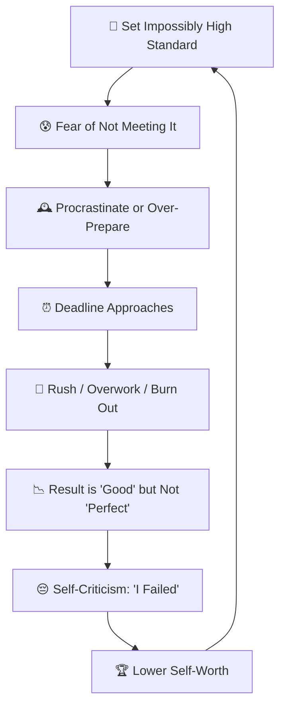
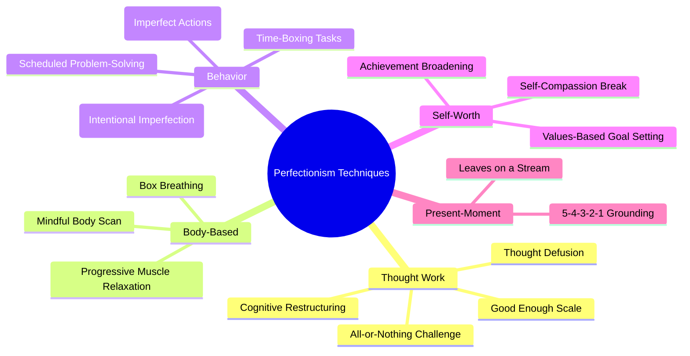
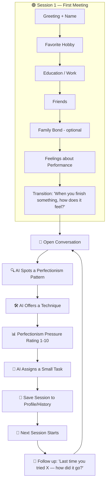
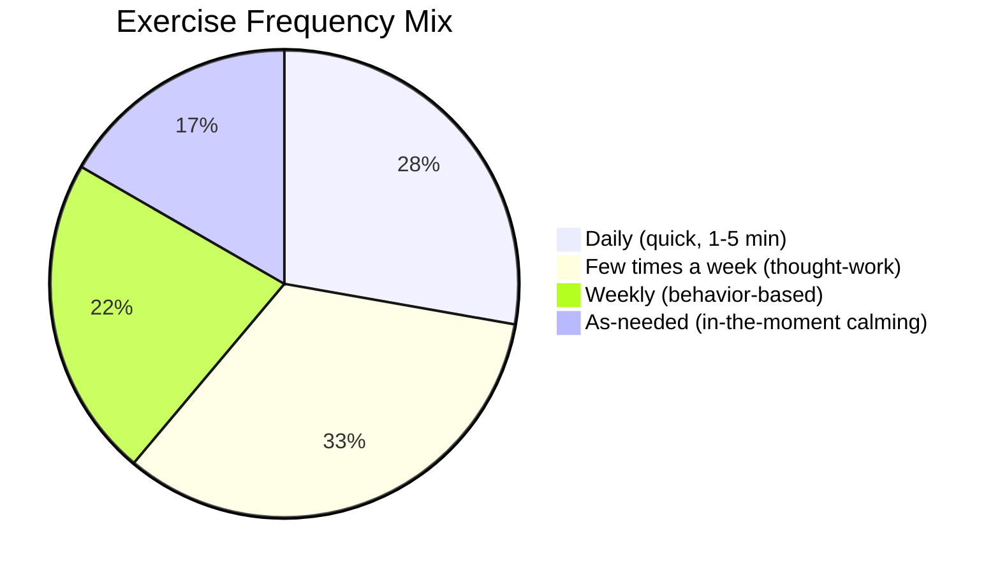
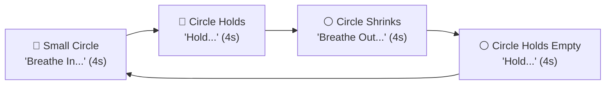

# 🎯 Perfectionist — Complete Research & App Design Document 🎯

*A full reference combining psychoeducation, CBT/ACT techniques, onboarding flow, exercise/task library, conversation examples, and progress-tracking design for this personality type's AI companion.*

---

## 1. 🧠 Overview

This personality type is defined less by fear of the future and more by an **internal pressure to perform flawlessly** — even when the stakes are objectively low.

**Core patterns:**
- 🎯 **Unrealistically high standards** — setting goals so high that "good enough" is never reached
- ⚫ **All-or-nothing thinking** — something is either perfect or a total failure; no middle ground
- 🕰️ **Procrastination** — delaying tasks because the fear of not doing them perfectly is paralyzing
- 🔍 **Over-checking & over-editing** — spending excessive time refining work, never feeling it's "done"
- 😤 **Harsh self-criticism** — beating yourself up over tiny mistakes others wouldn't notice
- 🏆 **Conditional self-worth** — feeling valuable only when achieving; feeling worthless otherwise
- 🙅 **Defensiveness to feedback** — treating constructive criticism as a personal attack
- 🧱 **Difficulty delegating** — insisting on doing everything yourself to ensure it's "right"
- 😔 **Inability to celebrate wins** — dismissing accomplishments with "it could have been better"
- 🔥 **Burnout & overworking** — pushing past exhaustion because resting feels like "giving up"

---

## 2. 🌱 Where It Comes From

- **Conditional love in childhood** — growing up where affection, praise, or attention was only given for achievements ("I only got noticed when I got good marks") 
- **Highly critical or demanding caregivers** — parents who focused on mistakes rather than effort, or who modeled perfectionism themselves 
- **Fear of shame & rejection** — perfectionism often starts as a protective shield: "If I'm perfect, no one can criticize me" 
- **Tying self-worth to achievement** — believing "I am only as good as my last result" 
- **Societal & cultural pressure** — academic/professional competition, social media comparisons, cultural emphasis on excellence 
- **Genetic predisposition** — studies suggest 23–42% of perfectionism traits may be heritable, especially neuroticism and conscientiousness 
- **Trauma or adverse childhood experiences** — bullying, chaotic home life, or neglect can drive perfectionism as a coping mechanism to regain control 

---

## 3. 🔄 The Perfectionism Trap



**The trap:** the temporary relief from over-preparing or over-checking feels like "doing something," but it reinforces the belief that only perfection is acceptable — which keeps the cycle going and guarantees exhaustion.

---

## 4. 🎯 Thinking Patterns Specific to This Type

| Pattern | What it looks like |
|---|---|
| ⚫ **All-or-nothing thinking** | "If it's not perfect, it's worthless" |
| 🎯 **Unrealistic standards** | Setting the bar so high that even excellent work feels like failure |
| 🔍 **Over-generalization from mistakes** | One small error = "I'm incompetent at everything" |
| 🏷️ **Labeling** | "I'm a failure" instead of "I made a mistake" |
| 📏 **"Should" statements** | "I should always give 100%" / "I should never make mistakes" |
| 🎭 **Catastrophizing about imperfection** | "If I mess this up, everyone will think I'm incompetent" |
| 🔄 **Mental filtering** — only noticing flaws | Ignoring 9 things done well, obsessing over 1 tiny flaw |
| 🏆 **Conditional self-worth** | "I'm only valuable when I achieve" |
| 🙅 **Discounting positives** | "That compliment doesn't count — they don't know the real me" |
| 🧱 **Control fallacy** — believing control equals safety | "If I plan every detail, nothing can go wrong" |

---

## 5. 🛠️ Techniques Library — with Conversation Examples



### 1️⃣ All-or-Nothing Challenge
**What it is:** Breaking the black-and-white thinking by finding the gray area between "perfect" and "failure."
**Use when:** User says something is "completely ruined" because of one flaw.

💬 **Example Conversation:**
> **User:** "I got 92% but I made two silly mistakes. I failed."
> **AI:** "Let's look at this differently. On a scale of 0 to 100, where 0 is 'complete disaster' and 100 is 'absolutely perfect' — where would 92% actually land?"
> **User:** "...I guess it's not a disaster."
> **AI:** "Right. Your mind is treating 92% like a 0, but in reality it's much closer to 100 than to 0. What would you tell a friend who got 92%?"

---

### 2️⃣ Good Enough Scale
**What it is:** Defining what "good enough" looks like *before* starting a task, so perfection isn't the only acceptable outcome.
**Use when:** User is stuck in over-preparing or over-editing.

💬 **Example Conversation:**
> **User:** "I've been editing this email for an hour and it's still not right."
> **AI:** "Before you edit one more time — what would 'good enough' look like for this email? Like, what are the 2-3 things it actually needs to do?"
> **User:** "Just... ask for the meeting time, I guess."
> **AI:** "Does it do that already?"
> **User:** "Yeah, it does."
> **AI:** "Then maybe 'good enough' is already here. What if you hit send right now?"

---

### 3️⃣ Intentional Imperfection (Behavioral Experiment)
**What it is:** Deliberately doing something imperfectly on a small scale to test whether the feared consequence actually happens.
**Use when:** Avoidance or procrastination due to fear of imperfection.

💬 **Example Conversation:**
> **User:** "I can't start this assignment because I know it won't be good enough."
> **AI:** "What if we tested that fear? Try writing the first paragraph badly on purpose — like, intentionally make it messy — and see what happens."
> **User:** "That sounds scary."
> **AI:** "I get it. But the experiment isn't about the paragraph — it's about testing whether 'imperfect = disaster' is actually true. Want to try?"

---

### 4️⃣ Time-Boxing
**What it is:** Setting a strict time limit for a task and stopping when time is up, regardless of whether it feels "perfect."
**Use when:** Overworking, over-editing, or spending excessive time on small tasks.

💬 **Example Conversation:**
> **User:** "I spent 5 hours on a presentation that should take 1 hour."
> **AI:** "Let's try something — for your next task, set a timer for the 'should take' time, and when it goes off, you stop. Even if it doesn't feel perfect."
> **User:** "But what if it's not good enough?"
> **AI:** "That's the experiment. Often, the difference between 1 hour and 5 hours of work is invisible to everyone else. Want to test that?"

---

### 5️⃣ Self-Compassion Break
**What it is:** Responding to self-criticism with the kindness you'd offer a friend.
**Use when:** User is being harsh with themselves for a mistake or imperfection.

💬 **Example Conversation:**
> **User:** "I can't believe I made that mistake in the meeting. I'm so stupid."
> **AI:** "If your best friend made that same mistake, what would you say to them?"
> **User:** "I'd probably say it's okay, everyone makes mistakes."
> **AI:** "Can you try saying that to yourself? Even if it feels weird at first — 'It's okay, everyone makes mistakes.'"

---

### 6️⃣ Box Breathing
**What it is:** 4-4-4-4 breathing pattern to calm the physical stress response from perfectionism pressure.
**Use when:** Racing thoughts, tension, or pre-deadline panic.

💬 **Example Conversation:**
> **AI:** "Your body sounds really tense right now. Want to try a slow breathing pattern with me for a minute?"
> **User:** "Okay."
> **AI:** "Breathe in for 4... hold for 4... out for 4... hold for 4. Let's do a few rounds together."

---

### 7️⃣ Achievement Broadening
**What it is:** Expanding what "counts" as valuable beyond just achievements — effort, kindness, courage, rest.
**Use when:** User ties all self-worth to grades, work, or external validation.

💬 **Example Conversation:**
> **User:** "I didn't do anything worthwhile today."
> **AI:** "Let's broaden the lens a little. Did you do anything kind today? Did you rest when you needed to? Did you try something hard?"
> **User:** "I helped my sister with homework... and I took a nap when I was tired."
> **AI:** "Those count too. Your worth isn't just in what you produce — it's also in how you show up for people, including yourself."

---

### 8️⃣ Values-Based Goal Setting
**What it is:** Setting goals based on what matters to the user (values) rather than what looks impressive (perfection).
**Use when:** User is chasing goals that feel hollow or externally driven.

💬 **Example Conversation:**
> **User:** "I need to get the highest marks in every subject."
> **AI:** "Is that because learning matters to you, or because getting the highest marks feels like the only way to be 'good enough'?"
> **User:** "...maybe the second one."
> **AI:** "What if we set a goal around actually understanding the subject, rather than the rank? What would that look like?"

---

### 9️⃣ Progressive Muscle Relaxation
**What it is:** Tense and release muscle groups to reduce physical tension from chronic stress/overworking.
**Use when:** Restlessness, trouble sleeping, or physical exhaustion from overworking.

💬 **Example Conversation:**
> **AI:** "Let's release some of that physical tension. Start by clenching your fists tightly for 5 seconds... now release. Notice the difference?"
> **User:** "Yeah, that actually feels looser."
> **AI:** "Let's move up through a few more muscle groups the same way."

---

### 🔟 Thought Defusion
**What it is:** "I'm having the thought that..." instead of treating the perfectionist thought as fact.
**Use when:** Rumination loops about not being "good enough."

💬 **Example Conversation:**
> **User:** "I'm a failure, I know it."
> **AI:** "Let's try saying that a little differently — 'I'm having the thought that I'm a failure.' How does it feel to add that phrase?"
> **User:** "A little more distant, I guess."
> **AI:** "That's the idea — a thought is something your mind is producing, not automatically the truth."

---

### 1️⃣1️⃣ Exposure Ladder (Imperfect Actions)
**What it is:** Facing the fear of imperfection gradually, from least to most scary.
**Use when:** Ongoing avoidance due to fear of not being perfect.

💬 **Example Conversation:**
> **AI:** "You mentioned you avoid sending emails without re-reading them 10 times. What's a much smaller version of that fear — something only a little uncomfortable?"
> **User:** "Maybe... sending a quick text without editing it?"
> **AI:** "That's a great starting step. We can build a ladder — from that, up to sending an email after one read-through — and take it one small rung at a time."

---

### 1️⃣2️⃣ Scheduled Problem-Solving
**What it is:** For worries that are about a real, solvable problem — set aside time to plan concrete next steps.
**Use when:** The worry is about something actionable, not just anxious "what ifs."

💬 **Example Conversation:**
> **AI:** "This one sounds like an actual problem we could plan for, not just a worry. Want to spend a few minutes listing real next steps you could take?"
> **User:** "Yeah, that would help."
> **AI:** "Great — what's step one, something small you could do today or tomorrow?"

---

### 1️⃣3️⃣ Mindful Body Scan
**What it is:** Slowly bringing attention through the body, noticing sensations without judgment.
**Use when:** User feels disconnected from their body due to overworking or mental exhaustion.

💬 **Example Conversation:**
> **AI:** "Let's try bringing your attention into your body for a minute. Start at your feet — what do you notice there? Warm, cold, tense, relaxed?"
> **User:** "Kind of tense, actually."
> **AI:** "That's okay, just notice it. Let's slowly move up — ankles, legs, stomach..."

---

### 1️⃣4️⃣ "Leaves on a Stream" (Cognitive Defusion)
**What it is:** Imagining each perfectionist thought as a leaf floating down a stream — noticing it, then letting it pass.
**Use when:** Thoughts feel sticky and hard to let go of.

💬 **Example Conversation:**
> **AI:** "Try imagining each critical thought as a leaf floating down a stream. You notice it, maybe even read what's written on it, and then just let it float on by — you don't have to jump in and chase it."
> **User:** "That's a nice way to picture it."
> **AI:** "Let's try it with the thought you just shared — picture it on a leaf, floating away."

---

### 1️⃣5️⃣ 5-4-3-2-1 Grounding
**What it is:** Name 5 things you see, 4 you hear, 3 you feel, 2 you smell, 1 you taste.
**Use when:** Mind is racing, user feels overwhelmed in the moment.

💬 **Example Conversation:**
> **AI:** "Your mind sounds really full right now. Let's slow down together — can you tell me 5 things you can see around you right now?"
> **User:** "My desk, a cup, my phone, the window, a plant."
> **AI:** "Good. Now 4 things you can hear?"
> *(continues through the senses)*
> **AI:** "How does your body feel now compared to a minute ago?"

---

### 1️⃣6️⃣ Present-Moment Anchor
**What it is:** Naming what's true right now, in this exact moment, vs. what the mind is projecting about "not being enough."
**Use when:** Mind stuck in future "what ifs" or past self-criticism.

💬 **Example Conversation:**
> **User:** "What if I mess up the presentation tomorrow?"
> **AI:** "Let's come back to right now for a second — in this exact moment, are you safe?"
> **User:** "...yeah, I guess I am right now."
> **AI:** "That's real. The 'what if' is your mind visiting a future that hasn't happened yet — this moment is the only one that's actually here."

---

## 6. 👋 Onboarding Flow — Session 1

Same gentle, slow pacing as any first meeting — one light question at a time, nothing heavy up front.

### Step 1 — Greeting + Name
**AI:** "Hi! I'm really glad you're here. Before we get into anything, I'd love to know — what should I call you?"

### Step 2 — Light Icebreaker (favorite hobby)
**AI:** "Quick fun one — what's something you enjoy doing just for fun, not because you have to?"

### Step 3 — Education / Work
**AI:** "What do you do these days — studying, working, or a bit of both?"

### Step 4 — Friends / Social Circle
**AI:** "Do you have a close friend or two you talk to when something's on your mind?"

### Step 5 — Family Bond (optional, gentle)
**AI:** "How are things at home — do you feel close to your family, or is it more complicated?"
*If hesitant:* "That's okay, we don't have to go deeper into that right now."

### Step 6 — Feelings About Performance
**AI:** "How do you feel about how you're doing in your studies or work — happy with it, or does it stress you out sometimes?"

### Step 7 — Transition (tuned for this type)
**AI:** "Thanks for sharing that, [Name]. I'm curious — when you finish something, how does it usually feel? Do you feel satisfied, or does your mind immediately find something that could have been better?"

*(Different from a broad "how have you been feeling" — this opens the door to perfectionism specifically.)*

---

## 7. 🔀 App Conversation Flow



---

## 8. 📋 Daily, Weekly & As-Needed Exercise Library



### 📅 Daily Checklist
| ✅ | Exercise | 💬 How the AI introduces it |
|---|---|---|
| ☐ | **Box Breathing** (2 min, animated) | "Want to take 2 minutes to calm your body with me before we start?" |
| ☐ | **Good Enough Check** (2 min) | "What's one thing you did today that was 'good enough' — even if it wasn't perfect?" |
| ☐ | **One Self-Compassion Moment** | "What's one kind thing you can say to yourself right now?" |
| ☐ | **Perfectionism Pressure Rating** (1-10) | "On a scale of 1-10, how much pressure are you putting on yourself to be perfect right now?" |
| ☐ | **One Thing Not About Achievement** | "What's one thing about you that has nothing to do with what you've achieved today?" |

### 🗓️ Weekly Tasks
| Task | 💬 Example AI Line |
|---|---|
| Practice Intentional Imperfection | "This week, try doing one small thing imperfectly on purpose — like sending a text without editing it. Notice what actually happens." |
| Set a "Good Enough" standard before starting | "Before your next task, define what 'good enough' looks like. Stop when you hit it." |
| Time-box one task | "Pick one task this week, set a timer for a reasonable amount of time, and stop when the timer goes off — even if it doesn't feel perfect." |
| One behavioral experiment | "Let's test one small feared prediction this week and compare it to what actually happens." |

### 🎯 As-Needed (in-the-moment, triggered by conversation)
All-or-Nothing Challenge · Good Enough Scale · Self-Compassion Break · Time-Boxing · 5-4-3-2-1 Grounding · Thought Defusion · Leaves on a Stream · Progressive Muscle Relaxation
*(see conversation examples for each in Section 5)*

### ✍️ Rotating Journaling Prompts
- "What's something I did this week that was 'good enough' — and the world didn't end?"
- "What's a mistake I made that taught me something useful?"
- "What would I tell a friend who was being this hard on themselves?"
- "What's one thing about me that has nothing to do with my grades, job, or achievements?"
- "What's a standard I'm holding myself to that I'd never hold a friend to?"

---

## 9. 🌬️ Breathing Exercise — Animation Spec



- Full **box breathing** cycle (4-4-4-4) — inhale, hold, exhale, hold — especially effective for calming the physical stress response from perfectionism pressure
- Soft, warm color palette (amber/gold), gentle pulsing rather than sharp movement
- Small round counter ("4 rounds done ✨")
- *(Flutter build note: same `AnimationController` + scaling circle approach as before, but with 4 phases instead of 3 — inhale, hold-full, exhale, hold-empty.)*

💬 **Example intro line:** "Let's slow your body down together. Follow the circle — in, hold, out, hold. Nice and steady."

---

## 10. 📝 Homework/Task Assignment & Follow-Up

**Golden rules:** one task at a time · small and doable in a day or two · always optional · always followed up next time.

💬 **Assigning a task (end of session):**
> **AI:** "That was a really good conversation today. Before we talk again, I'd love for you to try something small — notice one thing you did that was 'good enough' instead of perfect. No pressure, just notice. I'll ask you about it next time!"

💬 **Following up (start of next session):**
> **AI:** "Hey [Name]! Last time you were going to try noticing one 'good enough' moment — how did that go?"
> **User (did it):** "Yeah, actually — I sent an email without re-reading it and nothing bad happened."
> **AI:** "That's a great catch — that's real evidence that 'good enough' is often... actually enough."
>
> **User (didn't do it):** "I forgot, sorry."
> **AI:** "That's totally okay — want to try it again, or try something different this time?"

---

## 11. 📊 Progress Tracking & Report System

### What gets logged each session
```
session_log:
  date / perfectionism_pressure_before / perfectionism_pressure_after
  distortion_flagged / distortion_self_caught
  technique_used / perfectionism_sample
  task_assigned / task_completed / task_reflection
  topic
```

### 4 Improvement Signals (tuned for this type)
1. **📈 Perfectionism Pressure Trend** — average pressure rating going down over weeks
2. **🎯 All-or-Nothing Catch Rate** — user spotting their own black-and-white thinking
3. **✅ "Good Enough" Moments** — increasing count of times user accepted "good enough"
4. **✅ Engagement Consistency** — showing up, completing tasks

### Example Report Card
```
📊 Your Progress — Last 4 Weeks

Perfectionism pressure:    📈 Improving
  Week 1: ██████████ 9/10
  Week 2: ████████   7/10
  Week 3: ██████     6/10
  Week 4: █████      5/10   (lower = less pressure)

All-or-nothing catches:   5 this month (up from 1)
"Good enough" moments:    8 this month
Tasks completed:          10 / 12
Most common trigger:     Academic performance

💬 You're catching the all-or-nothing thinking on your own more often now —
    and you're letting "good enough" be enough. That's real progress. Keep going. 🌱
```

### 🚩 Escalation Triggers
- Frequent panic attacks or severe burnout
- Perfectionism feeling completely unmanageable
- Any mention of hopelessness or self-harm
- Sudden drop in engagement after worsening pressure ratings

→ In any of these cases, the app should gently point to a licensed professional or crisis resource, not attempt to handle it alone.

---

## 12. 🛡️ Guardrails

- ❌ Never use words like "cured," "recovered," or a clinical "disorder" label anywhere in the app
- ✅ Use progress language instead: "improving," "steady," "needs more support"
- ❌ Never force an answer — especially about family; log "not shared" and move on
- ✅ Keep an always-visible, easy way to reach professional/crisis resources
- ✅ If the user is a minor, keep personal questions extra light and be careful about what's stored long-term
- ✅ Every task is optional ("if you'd like to try...") — never framed as mandatory or a pass/fail test
- ✅ Keep this personality type's data **completely separate** from the other personality type's profile, techniques, and report — some ideas overlap, but the framing, priority order, and language differ

---

## 13. 🩺 Screening Questionnaires

*Validated screeners for the AI to reference when gauging severity — not shown to the user as a clinical test, just internal signal.*

### 1️⃣ PHQ-9 — Patient Health Questionnaire (Depression Screener)

> *Over the last 2 weeks, how often have you been bothered by any of the following problems?*

| # | Question |
|---|----------|
| 1 | 😔 Little interest or pleasure in doing things |
| 2 | 🌧️ Feeling down, depressed, or hopeless |
| 3 | 😴 Trouble falling or staying asleep, or sleeping too much |
| 4 | 🔋 Feeling tired or having little energy |
| 5 | 🍽️ Poor appetite or overeating |
| 6 | 💭 Feeling bad about yourself — or that you are a failure, or have let yourself or your family down |
| 7 | 📖 Trouble concentrating on things, such as reading or watching TV |
| 8 | 🐢 Moving or speaking noticeably slower than usual, or being fidgety/restless |
| 9 | ⚠️ Thoughts that you would be better off dead, or of hurting yourself in some way |

**Response scale:**

| Response | Score |
|----------|:-----:|
| Not at all | 0 |
| Several days | 1 |
| More than half the days | 2 |
| Nearly every day | 3 |

**📊 Scoring:** Sum all 9 items. Total range **0–27**.

| Score | Severity |
|:-----:|----------|
| 0–4 | 🟢 Minimal |
| 5–9 | 🟡 Mild |
| 10–14 | 🟠 Moderate |
| 15–19 | 🔴 Moderately severe |
| 20–27 | 🔴 Severe |

---

### 2️⃣ GAD-7 — Generalized Anxiety Disorder Screener

> *Over the last 2 weeks, how often have you been bothered by the following?*

| # | Question |
|---|----------|
| 1 | 😬 Feeling nervous, anxious, or on edge |
| 2 | 🌀 Not being able to stop or control worrying |
| 3 | 🔁 Worrying too much about different things |
| 4 | 😮‍💨 Trouble relaxing |
| 5 | 🦵 Being so restless that it is hard to sit still |
| 6 | 😤 Becoming easily annoyed or irritable |
| 7 | 😨 Feeling afraid as if something awful might happen |

**Response scale:** same as PHQ-9 (0 = Not at all → 3 = Nearly every day)

**📊 Scoring:** Sum all 7 items. Total range **0–21**.

| Score | Severity |
|:-----:|----------|
| 5+ | 🟡 Mild |
| 10+ | 🟠 Moderate |
| 15+ | 🔴 Severe |

---

### 3️⃣ PSS — Perceived Stress Scale (short form)

> *In the last month, how often have you felt this way?*

| # | Question | Direction |
|---|----------|:---------:|
| 1 | 🌊 Unable to control the important things in your life | negative |
| 2 | 💪 Confident about your ability to handle personal problems | ✅ positive |
| 3 | ☀️ Things were going your way | ✅ positive |
| 4 | 📚 Could not cope with all the things you had to do | negative |
| 5 | 🗻 Difficulties were piling up so high you could not overcome them | negative |

**Response scale:**

| Response | Score |
|----------|:-----:|
| Never | 0 |
| Almost never | 1 |
| Sometimes | 2 |
| Fairly often | 3 |
| Very often | 4 |

**📊 Scoring:**
1. Reverse-score items **2 and 3** (they're positively worded): 0→4, 1→3, 2→2, 3→1, 4→0
2. Sum all 5 item scores. Total range **0–20**.

| Score | Stress Level |
|:-----:|----------|
| 0–6 | 🟢 Low stress |
| 7–13 | 🟡 Moderate stress |
| 14–20 | 🔴 High stress |

> ℹ️ **Note:** This is a 5-item excerpt of the full 10-item PSS-10. The bands above are a proportional adaptation for this shortened set — not an officially published PSS cutoff. The original has no developer-published severity bands, only a raw sum (0–40 for PSS-10, 0–16 for PSS-4) where higher = more perceived stress.

---

## 🔑 Key Differences from Anxious/Overthinker Type

| Dimension | Anxious / Overthinker | Perfectionist |
|---|---|---|
| **Core fear** | Uncertainty / worst-case scenarios | Imperfection / not being "good enough" |
| **Mental loop** | "What if X goes wrong?" | "This isn't perfect enough" |
| **Safety behavior** | Reassurance-seeking, avoidance | Over-preparing, over-checking, procrastination |
| **Self-view** | "Something bad will happen" | "I am only as good as my last achievement" |
| **Key technique** | Probability check, worry time | All-or-nothing challenge, good enough scale |
| **Progress signal** | Worry intensity ↓, reassurance-seeking ↓ | Perfectionism pressure ↓, "good enough" moments ↑ |
| **Tone of AI** | Calming, grounding | Encouraging, permission-giving |
| **Key phrase** | "Let's come back to right now" | "Good enough is enough" |

---

This document mirrors the structure, depth, and tone of your partner's Anxious/Overthinker research so you can both integrate seamlessly into the PeaceMind AI app. Let me know if you want me to expand any section or add more conversation examples!
