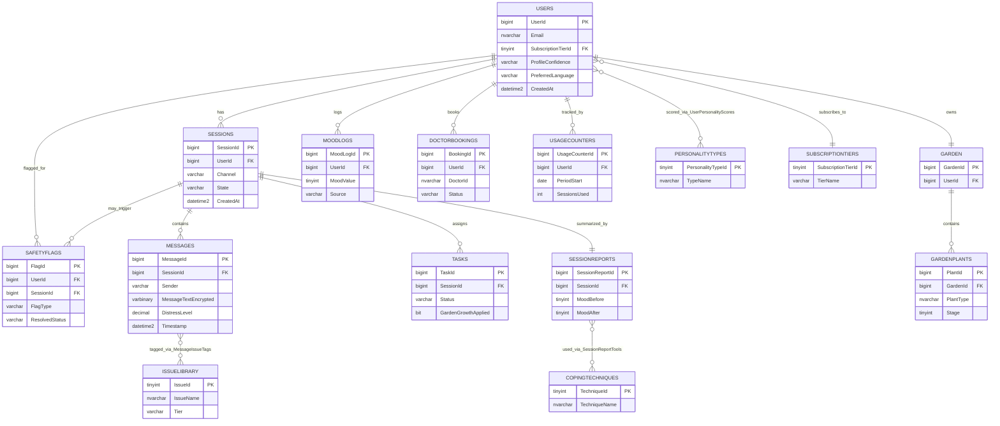

# PeaceMind AI — SQL Server Database Design Document

| Field | Value |
|---|---|
| **Document Type** | Database Design Document (relational — SQL Server) |
| **Source** | Derived from PeaceMind AI Product PRD v2.2, Technical PRD v1.1 (§7 Data Model), and the Firestore-vs-SQL-Server comparison (§6 Hybrid Approach) |
| **Status** | Draft — Hybrid scope |
| **Note** | No SQL scripts included — design only (tables, types, relationships, indexes, constraints, seed data, strategy) |
| **Architecture** | **Hybrid**: Firestore stays system-of-record for the live, real-time app; SQL Server (this document) is system-of-record for analytics, reporting, safety audit, billing, and reference data — see §1.1 |

---

## 1. Overview

PeaceMind AI's reference architecture uses Cloud Firestore (document-based). This document re-expresses that same data model as a **normalized relational schema for SQL Server**, so the design can be implemented with SSMS / EF Core / a Node.js ORM instead of Firestore, while preserving every entity, relationship, and business rule from the Technical PRD (§4.1 Cloud Functions inventory, §5 AI/Conversation Engine, §6 Crisis Handling, §7 Data Model, §11 Monetization).

Firestore arrays and maps (`detected_issue_tags`, `personality_profile`, `tools_used`, `plants`) are normalized into junction/lookup tables, since SQL Server has no native array/map column type — this is explained further in §10 (Normalization).

### 1.1 Hybrid Scope — What Lives Where

Real-time chat, offline support, and auto-scaling to 10,000+ DAU are Firestore's strengths; data integrity, complex analytics/reporting, and append-only audit safety are SQL Server's strengths. This design does **not** replace Firestore — it defines the **SQL Server side of a hybrid architecture**, where each store is system-of-record for what it's best at:

```
┌───────────────────────────┐        ┌────────────────────────────┐
│   FIRESTORE (live app)    │        │   SQL SERVER (this doc)     │
│   system-of-record for:   │  sync  │   system-of-record for:     │
│   • Live chat & messages  │ ─────► │   • SafetyFlags (audit)     │
│   • Active session state  │        │   • SessionReports          │
│   • Tasks / Garden state  │        │   • UserPersonalityScores   │
│   • MoodLogs (quick taps) │        │   • UsageCounters (billing) │
│                            │        │   • DoctorBookings          │
│                            │        │   • Lookup tables (§8)      │
└───────────────────────────┘        └──────────────────────────────┘
```

- **Stays authoritative in Firestore** (not modeled as SQL tables in this doc): live `Sessions`/`Messages` during an active conversation, `Tasks`, `Garden`/`GardenPlants` while the app is in use, and tap/journal `MoodLogs` — these need the sub-500ms crisis-detection path and native offline persistence Tech PRD §6/§10 requires.
- **Authoritative in SQL Server** (tables in this document, §3): `SafetyFlags`, `SessionReports`, `UserPersonalityScores`, `UsageCounters`, `DoctorBookings`, and all four lookup tables (`SubscriptionTiers`, `PersonalityTypes`, `IssueLibrary`, `CopingTechniques`) — these benefit from FK/CHECK enforcement, JOIN-based analytics, and DB-enforced append-only rules that Firestore Rules can't guarantee as strongly (comparison doc §3.1, §3.5).
- **`Users`, `Sessions`, `Messages`, `Tasks`, `Garden`, `GardenPlants`, `MoodLogs`** are still fully defined below (§3) because SQL Server holds a **synced, reporting-oriented copy** of them — the live/writable copy stays in Firestore; SQL Server's copy is read-mostly and feeds dashboards, clinician exports, and the JOIN-heavy queries in §11.
- **`SafetyFlags` is the one exception written directly to SQL Server**, not synced — see §9.1 for why.

---

## 2. Table Summary

| # | Table | Purpose | System of Record |
|---|---|---|---|
| 1 | `Users` | Core user/account record | Firestore (synced copy here) |
| 2 | `SubscriptionTiers` | Lookup: Free / Basic / Premium | **SQL Server** |
| 3 | `PersonalityTypes` | Lookup: the 5 behavioral profiles + General/Mixed | **SQL Server** |
| 4 | `UserPersonalityScores` | Weighted 0–1 score per user per personality type | **SQL Server** |
| 5 | `IssueLibrary` | Lookup: the 6 core issues + tier (Standard/Crisis) | **SQL Server** |
| 6 | `CopingTechniques` | Lookup: the 8 clinically-reviewed techniques | **SQL Server** |
| 7 | `Sessions` | A chat or voice session | Firestore (synced copy here) |
| 8 | `Messages` | Individual chat/voice-transcript messages | Firestore (synced copy here) |
| 9 | `MessageIssueTags` | Junction: message ↔ detected issue(s) | **SQL Server** (derived at sync time) |
| 10 | `Tasks` | Assigned coping tasks tied to a session | Firestore (synced copy here) |
| 11 | `Garden` | One garden per user (gamification) | Firestore (synced copy here) |
| 12 | `GardenPlants` | Plants unlocked in a user's garden | Firestore (synced copy here) |
| 13 | `SessionReports` | End-of-session summary | **SQL Server** |
| 14 | `SessionReportTools` | Junction: session report ↔ technique(s) used | **SQL Server** |
| 15 | `MoodLogs` | Standalone mood check-ins (tap/journal) | Firestore (synced copy here) |
| 16 | `SafetyFlags` | Crisis/flagged-issue audit log (append-only) | **SQL Server** (direct-write, not synced — §9.1) |
| 17 | `DoctorBookings` | Premium-tier doctor booking records | **SQL Server** |
| 18 | `UsageCounters` | Rolling per-period usage for entitlement enforcement | **SQL Server** |

---

## 3. Tables, Columns & Data Types

### 3.1 `Users`
| Column | Data Type | Nullable | Notes |
|---|---|---|---|
| `UserId` | `BIGINT IDENTITY(1,1)` | No | **PK** |
| `Email` | `NVARCHAR(256)` | No | Unique |
| `AuthProvider` | `VARCHAR(20)` | No | e.g. `password`, `google` |
| `PasswordHash` | `VARBINARY(256)` | Yes | Null if federated auth |
| `SubscriptionTierId` | `TINYINT` | No | **FK** → `SubscriptionTiers` |
| `ProfileConfidence` | `VARCHAR(11)` | No | `provisional` / `established`, default `provisional` |
| `LastRescoredAt` | `DATETIME2(0)` | Yes | |
| `PreferredLanguage` | `VARCHAR(8)` | No | `en` / `ur` / `ur-roman`, default `en` |
| `CreatedAt` | `DATETIME2(0)` | No | Default `SYSUTCDATETIME()` |
| `IsDeleted` | `BIT` | No | Default `0` — soft delete for `deleteUserData` |
| `DeletedAt` | `DATETIME2(0)` | Yes | Set on soft delete |

### 3.2 `SubscriptionTiers` (lookup)
| Column | Data Type | Nullable | Notes |
|---|---|---|---|
| `SubscriptionTierId` | `TINYINT` | No | **PK** |
| `TierName` | `VARCHAR(10)` | No | `free` / `basic` / `premium` |
| `Description` | `NVARCHAR(200)` | Yes | |

### 3.3 `PersonalityTypes` (lookup)
| Column | Data Type | Nullable | Notes |
|---|---|---|---|
| `PersonalityTypeId` | `TINYINT` | No | **PK** |
| `TypeName` | `NVARCHAR(50)` | No | e.g. `Anxious / Overthinker` |
| `Description` | `NVARCHAR(500)` | Yes | Related concerns + behavior summary |

### 3.4 `UserPersonalityScores`
| Column | Data Type | Nullable | Notes |
|---|---|---|---|
| `UserId` | `BIGINT` | No | **PK (composite)**, **FK** → `Users` |
| `PersonalityTypeId` | `TINYINT` | No | **PK (composite)**, **FK** → `PersonalityTypes` |
| `Weight` | `DECIMAL(4,3)` | No | 0.000–1.000, blended score |
| `UpdatedAt` | `DATETIME2(0)` | No | Last incremental update |

### 3.5 `IssueLibrary` (lookup)
| Column | Data Type | Nullable | Notes |
|---|---|---|---|
| `IssueId` | `TINYINT` | No | **PK** |
| `IssueName` | `NVARCHAR(50)` | No | e.g. `Anxiety`, `Domestic Violence` |
| `Tier` | `VARCHAR(8)` | No | `Standard` / `Crisis` |
| `Description` | `NVARCHAR(500)` | Yes | |

### 3.6 `CopingTechniques` (lookup)
| Column | Data Type | Nullable | Notes |
|---|---|---|---|
| `TechniqueId` | `TINYINT` | No | **PK** |
| `TechniqueName` | `NVARCHAR(50)` | No | e.g. `Box Breathing` |
| `UsageContext` | `NVARCHAR(200)` | Yes | When it's used |
| `ScoringMetric` | `NVARCHAR(200)` | Yes | How progress is tracked |

### 3.7 `Sessions`
| Column | Data Type | Nullable | Notes |
|---|---|---|---|
| `SessionId` | `BIGINT IDENTITY(1,1)` | No | **PK** |
| `UserId` | `BIGINT` | No | **FK** → `Users` |
| `Channel` | `VARCHAR(5)` | No | `chat` / `voice` |
| `State` | `VARCHAR(12)` | No | `open` / `guarded` / `withdrawing` / `re-engaging` |
| `MessageLengthAvg` | `DECIMAL(6,2)` | Yes | Materialized signal (not a normalization violation — see §10) |
| `LatencyAvg` | `DECIMAL(8,2)` | Yes | Avg. reply latency, seconds |
| `DeflectionCount` | `INT` | No | Default `0` |
| `TopicSwitchCount` | `INT` | No | Default `0` |
| `CreatedAt` | `DATETIME2(0)` | No | Default `SYSUTCDATETIME()` |

### 3.8 `Messages`
| Column | Data Type | Nullable | Notes |
|---|---|---|---|
| `MessageId` | `BIGINT IDENTITY(1,1)` | No | **PK** |
| `SessionId` | `BIGINT` | No | **FK** → `Sessions` |
| `Sender` | `VARCHAR(4)` | No | `user` / `ai` |
| `MessageTextEncrypted` | `VARBINARY(MAX)` | No | App-layer-encrypted ciphertext (matches Tech PRD §9) |
| `Timestamp` | `DATETIME2(3)` | No | Millisecond precision for chat ordering |
| `DetectedLanguage` | `VARCHAR(8)` | Yes | |
| `DistressLevel` | `DECIMAL(4,3)` | Yes | 0.000–1.000, drives proactive-exercise trigger |

### 3.9 `MessageIssueTags` (junction)
| Column | Data Type | Nullable | Notes |
|---|---|---|---|
| `MessageId` | `BIGINT` | No | **PK (composite)**, **FK** → `Messages` |
| `IssueId` | `TINYINT` | No | **PK (composite)**, **FK** → `IssueLibrary` |

### 3.10 `Tasks`
| Column | Data Type | Nullable | Notes |
|---|---|---|---|
| `TaskId` | `BIGINT IDENTITY(1,1)` | No | **PK** |
| `SessionId` | `BIGINT` | No | **FK** → `Sessions` |
| `Description` | `NVARCHAR(500)` | No | |
| `AssignedAt` | `DATETIME2(0)` | No | Default `SYSUTCDATETIME()` |
| `Status` | `VARCHAR(9)` | No | `pending` / `completed` |
| `GardenGrowthApplied` | `BIT` | No | Default `0` — set only by server logic |

### 3.11 `Garden`
| Column | Data Type | Nullable | Notes |
|---|---|---|---|
| `GardenId` | `BIGINT IDENTITY(1,1)` | No | **PK** |
| `UserId` | `BIGINT` | No | **FK** → `Users`, **UNIQUE** (1:1) |

### 3.12 `GardenPlants`
| Column | Data Type | Nullable | Notes |
|---|---|---|---|
| `PlantId` | `BIGINT IDENTITY(1,1)` | No | **PK** |
| `GardenId` | `BIGINT` | No | **FK** → `Garden` |
| `PlantType` | `NVARCHAR(50)` | No | |
| `Stage` | `TINYINT` | No | Growth stage |
| `UnlockedAt` | `DATETIME2(0)` | No | |

### 3.13 `SessionReports`
| Column | Data Type | Nullable | Notes |
|---|---|---|---|
| `SessionReportId` | `BIGINT IDENTITY(1,1)` | No | **PK** |
| `SessionId` | `BIGINT` | No | **FK** → `Sessions`, **UNIQUE** (1:1) |
| `MoodBefore` | `TINYINT` | Yes | 1–10 |
| `MoodAfter` | `TINYINT` | Yes | 1–10 |
| `Insight` | `NVARCHAR(MAX)` | Yes | |
| `NextStep` | `NVARCHAR(500)` | Yes | |

### 3.14 `SessionReportTools` (junction)
| Column | Data Type | Nullable | Notes |
|---|---|---|---|
| `SessionReportId` | `BIGINT` | No | **PK (composite)**, **FK** → `SessionReports` |
| `TechniqueId` | `TINYINT` | No | **PK (composite)**, **FK** → `CopingTechniques` |

### 3.15 `MoodLogs`
| Column | Data Type | Nullable | Notes |
|---|---|---|---|
| `MoodLogId` | `BIGINT IDENTITY(1,1)` | No | **PK** |
| `UserId` | `BIGINT` | No | **FK** → `Users` |
| `Timestamp` | `DATETIME2(0)` | No | |
| `MoodValue` | `TINYINT` | No | 1–10 |
| `Source` | `VARCHAR(7)` | No | `tap` / `journal` |

### 3.16 `SafetyFlags`
| Column | Data Type | Nullable | Notes |
|---|---|---|---|
| `FlagId` | `BIGINT IDENTITY(1,1)` | No | **PK** |
| `UserId` | `BIGINT` | No | **FK** → `Users` |
| `SessionId` | `BIGINT` | Yes | **FK** → `Sessions` (nullable — some flags are cross-session) |
| `FlagType` | `VARCHAR(14)` | No | `crisis` / `flagged_issue` |
| `Details` | `NVARCHAR(MAX)` | Yes | |
| `ResolvedStatus` | `VARCHAR(20)` | No | Default `open` |
| `Timestamp` | `DATETIME2(3)` | No | |

### 3.17 `DoctorBookings`
| Column | Data Type | Nullable | Notes |
|---|---|---|---|
| `BookingId` | `BIGINT IDENTITY(1,1)` | No | **PK** |
| `UserId` | `BIGINT` | No | **FK** → `Users` (Premium only, enforced in app layer) |
| `DoctorId` | `NVARCHAR(50)` | No | External partner reference (provider TBD per PRD §13) |
| `ScheduledAt` | `DATETIME2(0)` | No | |
| `Status` | `VARCHAR(20)` | No | |

### 3.18 `UsageCounters`
| Column | Data Type | Nullable | Notes |
|---|---|---|---|
| `UsageCounterId` | `BIGINT IDENTITY(1,1)` | No | **PK** |
| `UserId` | `BIGINT` | No | **FK** → `Users` |
| `PeriodStart` | `DATE` | No | First day of billing/usage period |
| `SessionsUsed` | `INT` | No | Default `0` |
| `ExercisesUsed` | `INT` | No | Default `0` |
| `VoiceMinutesUsed` | `DECIMAL(6,2)` | No | Default `0` |

---

## 4. Relationships

| Relationship | Cardinality |
|---|---|
| `Users` → `SubscriptionTiers` | Many-to-One |
| `Users` ↔ `PersonalityTypes` (via `UserPersonalityScores`) | Many-to-Many |
| `Users` → `Sessions` | One-to-Many |
| `Sessions` → `Messages` | One-to-Many |
| `Messages` ↔ `IssueLibrary` (via `MessageIssueTags`) | Many-to-Many |
| `Sessions` → `Tasks` | One-to-Many |
| `Users` → `Garden` | One-to-One |
| `Garden` → `GardenPlants` | One-to-Many |
| `Sessions` → `SessionReports` | One-to-One |
| `SessionReports` ↔ `CopingTechniques` (via `SessionReportTools`) | Many-to-Many |
| `Users` → `MoodLogs` | One-to-Many |
| `Users` → `SafetyFlags` | One-to-Many |
| `Sessions` → `SafetyFlags` | One-to-Many (nullable) |
| `Users` → `DoctorBookings` | One-to-Many |
| `Users` → `UsageCounters` | One-to-Many (one row per period) |

---

## 5. Indexes

| Index | Table | Columns | Purpose |
|---|---|---|---|
| `UX_Users_Email` | `Users` | `Email` (unique) | Login lookup, prevents duplicate accounts |
| `IX_Sessions_UserId_CreatedAt` | `Sessions` | `UserId, CreatedAt DESC` | Home/History screen — latest sessions per user |
| `IX_Messages_SessionId_Timestamp` | `Messages` | `SessionId, Timestamp` | Chronological chat rendering (composite, matches Firestore composite index in Tech PRD §7.1) |
| `IX_SafetyFlags_Timestamp_Type` | `SafetyFlags` | `Timestamp, FlagType` | Audit/monitoring dashboards |
| `IX_MoodLogs_UserId_Timestamp` | `MoodLogs` | `UserId, Timestamp` | Mood trend chart (Progress Dashboard) |
| `IX_Tasks_SessionId_Status` | `Tasks` | `SessionId, Status` (filtered `WHERE Status = 'pending'`) | Fast lookup of open tasks |
| `IX_UsageCounters_UserId_PeriodStart` | `UsageCounters` | `UserId, PeriodStart` (unique) | Entitlement check per period |
| `IX_DoctorBookings_UserId_ScheduledAt` | `DoctorBookings` | `UserId, ScheduledAt` | Upcoming-appointments lookup |

---

## 6. Constraints

- **NOT NULL** on all identity/foreign-key/business-critical columns listed above.
- **CHECK constraints** on all enum-like columns, e.g.:
  - `Sessions.Channel IN ('chat','voice')`
  - `Sessions.State IN ('open','guarded','withdrawing','re-engaging')`
  - `Messages.Sender IN ('user','ai')`
  - `Messages.DistressLevel BETWEEN 0 AND 1`
  - `Users.ProfileConfidence IN ('provisional','established')`
  - `Users.PreferredLanguage IN ('en','ur','ur-roman')`
  - `IssueLibrary.Tier IN ('Standard','Crisis')`
  - `MoodLogs.MoodValue BETWEEN 1 AND 10`
  - `SessionReports.MoodBefore BETWEEN 1 AND 10`, `MoodAfter BETWEEN 1 AND 10`
- **DEFAULT constraints**: `CreatedAt`/`Timestamp` columns default to `SYSUTCDATETIME()`; counters default to `0`; `Tasks.Status` defaults to `pending`; `SafetyFlags.ResolvedStatus` defaults to `open`.
- **UNIQUE constraints**: `Users.Email`, `Garden.UserId`, `SessionReports.SessionId`.
- **Append-only enforcement on `SafetyFlags`**: no client role is granted `UPDATE`/`DELETE` on this table (matches Firestore rule in Tech PRD §4.2/§6) — enforced via SQL Server role permissions, optionally reinforced with an `INSTEAD OF UPDATE/DELETE` trigger that rejects the operation for all but a dedicated audit-service login. As noted in §9.1, this table is written directly by the crisis-detection Cloud Function (not synced from Firestore on a delay), so the append-only guarantee holds from the moment a flag is raised.

---

## 7. Foreign Keys

| FK | Child Table | Parent Table | On Delete |
|---|---|---|---|
| `FK_Users_SubscriptionTier` | `Users` | `SubscriptionTiers` | `NO ACTION` |
| `FK_UserPersonalityScores_User` | `UserPersonalityScores` | `Users` | `CASCADE` |
| `FK_UserPersonalityScores_PersonalityType` | `UserPersonalityScores` | `PersonalityTypes` | `NO ACTION` |
| `FK_Sessions_User` | `Sessions` | `Users` | `CASCADE` |
| `FK_Messages_Session` | `Messages` | `Sessions` | `CASCADE` |
| `FK_MessageIssueTags_Message` | `MessageIssueTags` | `Messages` | `CASCADE` |
| `FK_MessageIssueTags_Issue` | `MessageIssueTags` | `IssueLibrary` | `NO ACTION` |
| `FK_Tasks_Session` | `Tasks` | `Sessions` | `CASCADE` |
| `FK_Garden_User` | `Garden` | `Users` | `CASCADE` |
| `FK_GardenPlants_Garden` | `GardenPlants` | `Garden` | `CASCADE` |
| `FK_SessionReports_Session` | `SessionReports` | `Sessions` | `CASCADE` |
| `FK_SessionReportTools_Report` | `SessionReportTools` | `SessionReports` | `CASCADE` |
| `FK_SessionReportTools_Technique` | `SessionReportTools` | `CopingTechniques` | `NO ACTION` |
| `FK_MoodLogs_User` | `MoodLogs` | `Users` | `CASCADE` |
| `FK_SafetyFlags_User` | `SafetyFlags` | `Users` | `NO ACTION` *(preserve audit trail even if user is later removed)* |
| `FK_SafetyFlags_Session` | `SafetyFlags` | `Sessions` | `NO ACTION` |
| `FK_DoctorBookings_User` | `DoctorBookings` | `Users` | `CASCADE` |
| `FK_UsageCounters_User` | `UsageCounters` | `Users` | `CASCADE` |

---

## 8. Seed Data

**`SubscriptionTiers`**
| TierId | TierName |
|---|---|
| 1 | free |
| 2 | basic |
| 3 | premium |

**`PersonalityTypes`**
| Id | TypeName |
|---|---|
| 1 | Anxious / Overthinker |
| 2 | Highly Analytical / Logical |
| 3 | Low Self-Esteem / Self-Critical |
| 4 | Avoidant / Withdrawn |
| 5 | Numb / Low-Activation |
| 6 | General / Mixed User |

**`IssueLibrary`**
| Id | IssueName | Tier |
|---|---|---|
| 1 | Domestic Violence | Crisis |
| 2 | Anger | Standard |
| 3 | Anxiety | Standard |
| 4 | Depression / Low Mood | Standard |
| 5 | Health Anxiety | Standard |
| 6 | Life Changes | Standard |

**`CopingTechniques`**
| Id | TechniqueName |
|---|---|
| 1 | Box Breathing |
| 2 | Grounding (5-4-3-2-1) |
| 3 | Mindful Walking |
| 4 | Release Tension |
| 5 | Body Scan |
| 6 | Cognitive Reframing |
| 7 | Accept Emotions |
| 8 | STOP Skill |

These four lookup tables ship as part of the initial migration and are versioned alongside the app (Tech PRD §5.2 notes the Issue Library and profile logic are "not hardcoded client-side" — the SQL Server tables are the server-side source of truth the Cloud Functions equivalent would read from).

---

## 9. Migration Strategy

Since the live reference architecture is Firestore, moving to SQL Server (or running it as a parallel/alternate backend for this implementation) follows a phased approach:

1. **Schema-first setup** — create all tables above in `dev`, apply lookup seed data (§8), version the schema with a migration tool (EF Core Migrations or Flyway) so every change is tracked and repeatable across `dev` / `staging` / `prod`, mirroring the environment split already defined in Tech PRD §13.
2. **Backfill / one-time export** — for any existing Firestore data, export each collection to JSON/CSV and load into the matching table, flattening arrays (`detected_issue_tags`, `personality_profile`, `tools_used`, `plants`) into the junction tables defined in §3.
3. **Dual-write window (optional, if cutting over a live app)** — write to both stores during a transition period so nothing is lost if issues are found; validate row counts and spot-check encrypted message integrity before cutover.
4. **Cutover** — point Cloud Functions equivalents (or the chosen backend service) at SQL Server exclusively; keep the Firestore export as a rollback snapshot for a defined retention window.
5. **Post-migration validation** — verify FK integrity, re-run entitlement/crisis-flow logic against the new store in `staging`, confirm indexes (§5) are being used via execution plans before promoting to `prod`.

### 9.1 Hybrid Sync Mechanism

Per §1.1, most tables here are a **synced, read-mostly copy** of Firestore collections, not the live/writable source:

- **Scheduled sync (nightly or hourly)** — a Cloud Function reads `sessions`, `messages`, `tasks`, `garden`, and `mood_logs` from Firestore and upserts them into the matching SQL Server tables (`Sessions`, `Messages`, `Tasks`, `Garden`/`GardenPlants`, `MoodLogs`), flattening Firestore arrays into the junction tables (§10) as it writes. This mirrors the comparison document's §6 hybrid diagram.
- **`Messages.detected_issue_tags`** (a Firestore array) is expanded into `MessageIssueTags` rows during this same sync step, so downstream JOIN/aggregate queries (§11) work without touching Firestore.
- **`SafetyFlags` is the one exception** — it is written **directly and synchronously** to SQL Server by the same Cloud Function that raises the flag in Firestore (dual-write, not batch-synced), because the append-only guarantee and audit trail (§6 Constraints) need to exist immediately, not after the next sync cycle. This matches the comparison doc's §3.1 conclusion that SQL Server "wins" for append-only/audit enforcement.
- **`UserPersonalityScores` and `SessionReports`** are written by the Cloud Function at the point the profile is re-scored / the session ends, rather than waiting for the scheduled sync — both are needed promptly for the Insight/Profile screen and end-of-session summary.
- **Reference/lookup tables** (`SubscriptionTiers`, `PersonalityTypes`, `IssueLibrary`, `CopingTechniques`) are authored directly in SQL Server (§8 seed data) and read into the app/Cloud Functions at startup or via a cached lookup — Firestore never owns this data.
- **Sync failures** are retried with backoff; a `LastSyncedAt` watermark per collection (not shown as a full table here — a small `SyncState` control table) tracks the last successfully synced document per entity so a failed run resumes rather than re-processing everything.

---

## 10. Normalization

- **1NF**: All columns hold atomic values. Firestore's array/map fields are decomposed: `detected_issue_tags` → `MessageIssueTags`, `personality_profile` → `UserPersonalityScores`, `tools_used` → `SessionReportTools`, `garden.plants` → `GardenPlants`.
- **2NF**: Every non-key column depends on the *whole* primary key — clearest in the composite-key junction tables (`MessageIssueTags`, `SessionReportTools`, `UserPersonalityScores`), where the only non-key attributes (`Weight`, `UpdatedAt`) depend on both parts of the key together.
- **3NF**: Descriptive/reference data (issue descriptions, technique guidance text, personality-type descriptions, tier descriptions) lives once in a lookup table rather than repeated on every `Message`/`SessionReport`/`User` row, removing transitive dependencies.
- **Intentional denormalization**: `Sessions.MessageLengthAvg`, `LatencyAvg`, `DeflectionCount`, and `TopicSwitchCount` are stored as materialized aggregates rather than computed live from `Messages` on every read — this mirrors the Tech PRD's own design (§1.2: cheap signals computed once per message write, not recomputed per read) and is a deliberate performance trade-off, not a normalization gap.

---

## 11. Performance Considerations

- **Composite indexes matching real query patterns** (§5) — e.g. chat rendering always filters by `SessionId` and orders by `Timestamp`, so that pairing is indexed together rather than as two separate single-column indexes.
- **`VARBINARY(MAX)` for encrypted message text** avoids storing plaintext and keeps the column out of any index (large object columns should never be indexed directly).
- **Filtered index** on `Tasks(Status = 'pending')` keeps the "open tasks" lookup small regardless of total historical task volume.
- **Avoid N+1 lookups**: personality scores, issue tags, and coping-tool usage are fetched via a single joined query per session/report rather than one round-trip per tag.
- **Connection pooling** at the application/service layer (mirrors Cloud Functions' short-lived, high-concurrency invocation pattern).
- **Async writes for non-blocking paths**: heavier signal writes (profile re-scoring, `UserPersonalityScores` updates) should be queued/batched rather than committed synchronously in the request path that returns the AI reply — same non-blocking principle as Tech PRD §1.2's async scoring function.
- **Crisis-path priority**: `SafetyFlags` writes and the underlying `Sessions`/`Users` lookups they depend on should be on a low-latency path (small row size, indexed, no large joins) since Tech PRD §6 sets a sub-500ms target for this flow.

---

## 12. Future Scalability

- **Table partitioning** on `Messages` and `MoodLogs` by date range (e.g. monthly) as history grows, keeping recent-data queries fast while older partitions can be archived or moved to cheaper storage.
- **Read replicas** for reporting/dashboard workloads (safety-flag audit views, mood-trend analytics) so they don't compete with the live chat write path.
- **Columnstore indexes** on `MoodLogs` and `SafetyFlags` if/when aggregate analytics (trend charts, clinical reporting) become a heavier workload than transactional reads.
- **Sharding by `UserId`** (or moving to Azure SQL Hyperscale) if a single instance becomes a bottleneck at high DAU, consistent with the 10,000+ DAU scalability target already noted for Firestore/Cloud Functions in Tech PRD §12.
- **Archival policy** for `Sessions`/`Messages` older than the data-retention window (Tech PRD §9/§13 — retention duration is still an open product decision) so the hot tables stay lean.
- **Decoupling `UsageCounters`** into a separate, frequently-reset table (already done above) keeps the high-write entitlement path isolated from slower-changing user/profile data.

---

## 13. Entity-Relationship Diagram


