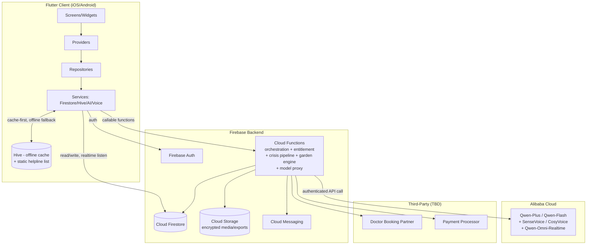
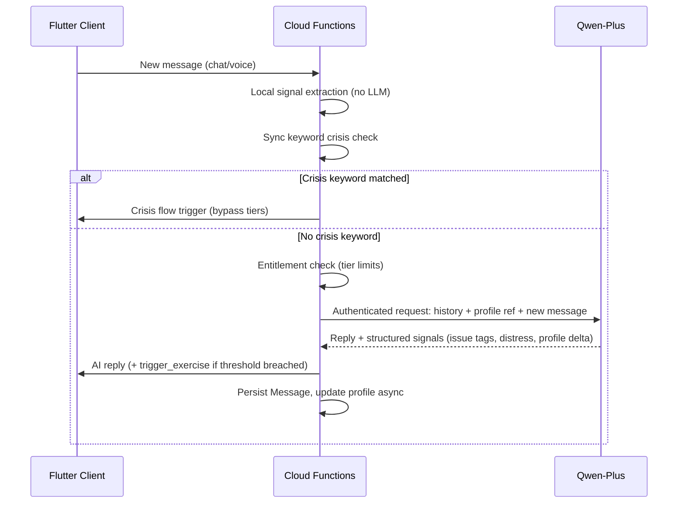
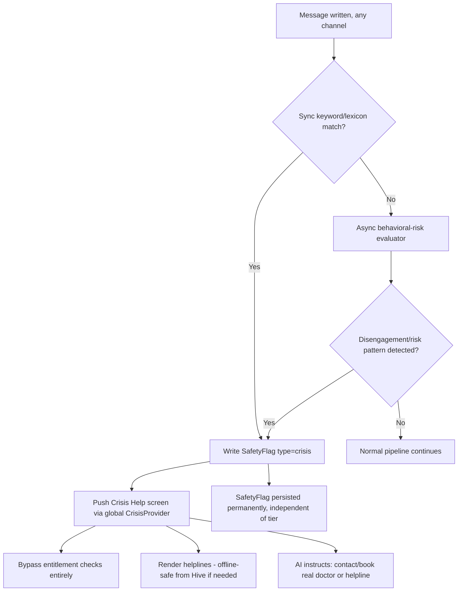

# Technical PRD: PeaceMind AI

**Document Owner:** Solution Architect
**Version:** 1.1
**Status:** Draft for Review
**Date:** August 15, 2026
**Reference:** [PeaceMind AI — Product Requirements Document, v2.2](./PRD.md)

---

## 1. Overview & Traceability

This Technical PRD translates the approved Product PRD (PeaceMind AI v2.2) into a concrete engineering design. Every architectural decision below is traceable to a section of the Product PRD — Functional Requirement sections (§4.x), the Data Model (§5), Technical Requirements (§6), or a User Story (§7). This document describes **architecture and design decisions**, not implementation code, and is the parent document for the companion **Backend Technical PRD**, **Frontend Technical PRD**, **Database/Firestore Design**, and **API Contract** documents that should follow it.

### 1.1 Approved Technology Stack

**Client**
- Flutter (Dart) — single codebase, iOS + Android
- Provider — state management
- Hive — local/offline cache
- `go_router` (or equivalent) — declarative routing, deep-link-ready for push-notification re-entry
- `flutter_localizations` + `intl` — English / Urdu / Roman Urdu

**Backend**
- Firebase Authentication — email + password (v1)
- Cloud Firestore — primary data store
- Firebase Cloud Functions (Node.js/TypeScript) — server-side orchestration, signal processing, crisis pipeline, entitlement enforcement
- Firebase Cloud Storage — encrypted media (voice clips, exported reports)
- Firebase Cloud Messaging (FCM) — push notifications
- Firebase App Check — abuse/bot protection on callable functions

**AI / Conversation Engine**
- Alibaba Cloud AI (Qwen models via Model Studio / DashScope) — core conversation, issue-library matching, behavioral-profile scoring
  - **Qwen-Plus** — primary conversation model, personality detection, silent PHQ-9/GAD-7/PSS scoring (1,000,000 token context)
  - **Qwen-Flash** — fast, cheap helper for crisis keyword pre-checks, intent routing, and simple reply parsing (replaces retired Qwen-Turbo)
  - **SenseVoice** — real-time voice emotion and tone detection from user voice messages
  - **CosyVoice** — text-to-speech generation for reading AI Avatar Scripts aloud (breathing guides, grounding scripts, calming narration)
  - **Qwen-Omni-Realtime** — end-to-end live audio call feature (listen, understand, and speak back in real time with interruption handling)
- API keys and model configuration stored in **Firebase Secret Manager / Cloud Functions environment config** (`.env` equivalent) — never bundled in the client binary

**Voice**
- Speech-to-Text / Text-to-Speech handled via the model-specific pipeline above (SenseVoice for emotion-aware STT, CosyVoice for guided-script TTS, Qwen-Omni-Realtime for live calls)

**Third-Party / Partner**
- Doctor-booking/scheduling integration (provider TBD — see §1.2)
- Payment/subscription processor for tier upgrades (provider TBD — see §1.2)

### 1.2 Key Design Decisions (Confirmed / Proposed)

| Decision | Resolution |
|---|---|
| Client-backend topology | Flutter client **never** calls Alibaba Cloud AI directly. All AI calls are proxied through Firebase Cloud Functions so API keys, rate-limiting, and prompt templates stay server-side. |
| Signal extraction split | Cheap, latency-sensitive signals (message length, inter-message latency, deflection/topic-switch count) are computed in a plain Cloud Function/trigger on every message write, **without** an LLM call, so the UI is never blocked waiting on inference (resolves PRD §6.1 Performance NFR). Heavier signals (issue-tag matching, distress level, profile re-scoring) run asynchronously via Cloud Functions calling Qwen-Plus and update the message/session/profile documents when ready. |
| Crisis-path latency | Keyword-based crisis detection runs synchronously and locally (Cloud Function regex/lexicon match, no LLM round-trip) so the Crisis Help screen can trigger in under ~500ms even if the model path is slow or down. Behavioral-disengagement-based crisis signals run asynchronously and can also trigger the same flow retroactively. |
| Offline crisis fallback | Static, region-appropriate helpline list ships bundled in Hive/local assets so Crisis Help renders with zero network dependency (resolves PRD §6.1 Reliability NFR). |
| Free/Basic/Premium entitlement enforcement | Enforced **server-side** in Cloud Functions (not just client UI-gating) against `User.subscription_tier` and a rolling usage counter, to prevent tier bypass via a modified client. Crisis flow explicitly bypasses this check at the function level, not just the UI level. |
| Doctor booking provider | Not selected yet (PRD §13 Open Question). Architecture defines a `DoctorBookingService` abstraction behind Cloud Functions so a concrete scheduling partner can be plugged in without client changes. |
| Payment processor | Not selected yet. Subscription state (`subscription_tier`, renewal date, status) is modeled generically in Firestore so any processor's webhook can update it via a single Cloud Function endpoint. |
| Personality profile visibility | `personality_profile` is written only by the server-side scoring function and is **never** returned to the client in any read path used by chat/UI screens — it is only exposed via the opt-in Doctor Summary Report export function, gated by explicit user consent. |
| Session identity model | "Session" is channel-agnostic (chat or voice) and unified per PRD §4.2 Cross-channel consistency — a single active session document can receive both chat `Message` writes and voice-call transcript writes. |
| Language detection | Server-side (Cloud Function) per-message language detection, not purely client-side, so voice-call STT and chat share one detection path and one source of truth for `detected_language`. |
| Garden growth authority | Garden state changes are written only by a Cloud Function reacting to `Task.status == completed`, never directly by the client, to prevent users from spoofing progress. |

---

## 2. System Architecture — High Level



**Non-negotiable boundary:** the Flutter client's `AiService` never holds an Alibaba Cloud credential and never sends raw message text anywhere except Firestore (encrypted) and the Cloud Functions callable endpoints. All model calls are Cloud-Function-mediated.

---

## 3. Client Architecture (Flutter)

Layering follows the structure defined in PRD §6.3, refined for a strict one-directional dependency rule: **Screens → Providers → Repositories → Services**. Screens never touch `services/` directly; Providers never touch Firestore/Hive directly.

```
peacemind_ai/
├── lib/
│   ├── main.dart
│   ├── app.dart
│   ├── core/
│   │   ├── constants.dart
│   │   ├── theme.dart
│   │   ├── routes.dart
│   │   └── utils/ (validators.dart, formatters.dart)
│   ├── l10n/                          # en / ur / roman-ur (ARB files)
│   ├── models/                        # plain Dart data classes, 1:1 with Firestore docs (see §7)
│   ├── services/                      # raw I/O only — no business logic
│   │   ├── firestore_service.dart
│   │   ├── hive_service.dart
│   │   ├── ai_service.dart            # calls Cloud Functions callable endpoints only
│   │   └── voice_service.dart         # STT/TTS session I/O
│   ├── repositories/                  # business-facing data access, used by providers
│   │   ├── auth_repository.dart
│   │   ├── chat_repository.dart
│   │   ├── session_repository.dart
│   │   ├── garden_repository.dart
│   │   ├── task_repository.dart
│   │   ├── crisis_repository.dart
│   │   └── billing_repository.dart
│   ├── providers/
│   │   ├── auth_provider.dart
│   │   ├── chat_provider.dart
│   │   ├── voice_call_provider.dart
│   │   ├── garden_provider.dart
│   │   ├── session_provider.dart
│   │   ├── settings_provider.dart
│   │   ├── billing_provider.dart
│   │   └── coping_tools_provider.dart
│   ├── screens/  (per PRD §6.3: splash, onboarding, auth, home, chat, voice_call,
│   │              coping_tools/*, post_session, garden, history, crisis, settings, upgrade)
│   └── widgets/                       # shared/global only
├── pubspec.yaml
└── android/app/build.gradle
```

### 3.1 State & Data Flow Conventions
- **Provider** exposes `ChangeNotifier`s per feature; no cross-provider direct calls — coordination happens through repositories or a lightweight event bus for cross-cutting events (e.g., crisis-triggered navigation).
- **Real-time data** (active chat session, distress-trigger events) is streamed via Firestore snapshot listeners wrapped in the repository layer, exposed to providers as `Stream<T>`.
- **Write-then-optimistic-update**: chat message sends update local provider state immediately, then reconcile on Firestore write confirmation; failure triggers a retry/queue via Hive (offline-safe compose).
- **Crisis interrupt**: a dedicated `CrisisProvider` listens globally (app-shell level, not screen-level) so the Crisis Help screen can be pushed from any screen the instant a `SafetyFlag` is raised, satisfying "Any screen → Crisis Help" in PRD §8.

### 3.2 Offline Behavior (Hive)
- Static crisis helpline list bundled at build time + refreshed opportunistically when online.
- Draft messages composed offline are queued and flushed on reconnect.
- Read-only cache of the last N session/history records for instant Home/History rendering before Firestore listener resolves.

---

## 4. Backend Architecture (Firebase)

### 4.1 Cloud Functions Inventory (by responsibility)

| Function | Trigger | Responsibility |
|---|---|---|
| `onMessageCreate` | Firestore `onCreate` (Message) | Runs lightweight local signal extraction (length, latency, deflection); writes `distress_level` seed + queues async scoring job |
| `scoreMessageAsync` | Pub/Sub task from `onMessageCreate` | Calls Qwen-Plus for issue-tag detection, behavioral-profile update; updates `Message.detected_issue_tags`, `User.personality_profile` |
| `detectCrisisSync` | Called inline within `onMessageCreate`, before return | Synchronous keyword/lexicon match (no LLM) → writes `SafetyFlag` + sets session state if matched |
| `evaluateBehavioralRisk` | Scheduled + event-driven | Evaluates session engagement/disengagement patterns for silent crisis risk (PRD §4.9) |
| `generateAiReply` | Callable (from chat/voice UI) | Orchestrates: entitlement check → Qwen-Plus conversation call → persists AI `Message` → checks distress threshold for proactive-exercise trigger |
| `startVoiceSession` / `streamVoiceTurn` | Callable / streaming | SenseVoice STT ingestion → routes text through same conversation pipeline as chat → CosyVoice TTS synthesis of reply |
| `startLiveAudioCall` | Callable | Initiates Qwen-Omni-Realtime session for live back-and-forth spoken conversation; handles interruptions and emotional tone control |
| `checkAndDecrementEntitlement` | Internal, called by `generateAiReply`/voice functions | Enforces Free/Basic/Premium session & voice-call limits (bypassed entirely for crisis) |
| `onTaskComplete` | Firestore `onUpdate` (Task.status → completed) | Applies Garden growth, writes `garden_growth_applied` |
| `generateSessionReport` | Callable, end-of-session | Produces `SessionReport` (mood before/after, tools used, insight, next step) |
| `generateDoctorSummaryReport` | Callable, opt-in only | Aggregates anonymized mood trend/themes/safety flags for export; requires explicit consent flag |
| `bookDoctorAppointment` | Callable (Premium only) | Wraps `DoctorBookingService` partner integration |
| `handleBillingWebhook` | HTTPS webhook | Updates `User.subscription_tier` from payment processor events |
| `sendReengagementPush` | Scheduled | Gentle, non-intrusive FCM notification (PRD §6 — never "we noticed you're quiet" copy) |
| `detectLanguage` | Called inline within `onMessageCreate` / voice ingestion | Sets `Message.detected_language`, informs reply language/voice |

### 4.2 Firestore Security Rules Strategy
- Per-user isolation: every top-level collection keyed/filtered by `user_id == request.auth.uid`; no cross-user reads.
- `personality_profile` and internal scoring fields on `User` are **not directly writable by the client** — writes restricted to Cloud Functions (service-account context) only; client has read access to non-sensitive subset via a projection, or no direct read at all (client never needs it — see §1.2).
- `SafetyFlag` documents: client can create only via the synchronous crisis-detection function's return path (not direct client writes) to prevent tampering with safety logs.
- `Garden` and `Task.garden_growth_applied`: client read-only; writes restricted to Cloud Functions.

---

## 5. AI / Conversation Engine Architecture

### 5.1 Conversation Pipeline
1. Client sends new user message → Firestore write (`Message`, channel = chat|voice).
2. `onMessageCreate` fires: local signal extraction (no LLM) + synchronous crisis keyword check.
3. If crisis keyword matched → short-circuit: crisis flow triggers immediately (see §6), conversation pipeline still logs the message but AI reply generation for that turn is replaced by crisis-mode response content.
4. Otherwise, `generateAiReply` is invoked (client callable or auto-chained): entitlement check → session history + prior profile summary assembled → request forwarded to **Qwen-Plus** via authenticated server-side API call.
5. Qwen-Plus processes raw chat context + user profile/issue-library reference; the model returns (a) the conversational reply text and (b) structured signals — issue tags, distress-level estimate, profile-weight deltas.
6. Cloud Function persists the AI `Message`, updates `Message.detected_issue_tags`/`distress_level`, and asynchronously updates `User.personality_profile`.
7. If `distress_level` crosses the proactive-exercise threshold, the same response includes a "trigger_exercise" directive consumed by the client to open the guided-exercise UI with spoken/text guidance (PRD §4.2).



### 5.2 Issue Library & Behavioral Profile

#### 5.2.1 Issue Library (6 Core Issues)
The Issue Library is maintained as a versioned reference dataset injected into the Qwen-Plus prompt/classification step, not hardcoded client-side. Each issue is assigned a tier that drives response intensity and safety rules.

| Issue | Tier | Helpful Techniques | How The AI Responds | How It's Tracked |
|---|---|---|---|---|
| **Domestic Violence** | **Crisis** | Grounding, box breathing, safety planning | Checks safety first: "Are you okay to keep chatting right now?" Keeps chat discreet. No normal coping steps. | Immediate crisis flag. Safety log. Refers to real helpline / professional. |
| **Anger** | **Standard** | Box breathing, release tension, STOP skill | Never argues back. Validates anger, cools the body first, talks after. | Anger rating before/after. Tracks outburst frequency. |
| **Anxiety** | **Standard** | Box breathing, grounding, cognitive reframing | Calm tone. One grounding step at a time. "You are safe right now." | Silent anxiety score. Anxiety rating 1–10 before/after. |
| **Depression / Low Mood** | **Standard** | Mindful walking, positive reframing, release tension, accept emotions | Low pressure. Celebrates tiny wins: "You got out of bed — that matters." | Silent depression score. Mood and energy tracking. |
| **Health Anxiety** | **Standard** | Grounding, box breathing | Never gives medical diagnosis. Validates fear without feeding it. Calms body first. | Silent anxiety score. Suggests doctor if physical worry continues. |
| **Life Changes** | **Standard** | Mindful walking, box breathing, cognitive reframing | Normalizes that change is stressful, even good change. Breaks it into small steps. | Silent stress score. Stress rating 1–10. |

*Tier definitions:*
- **Standard** — everyday support with gentle coping techniques
- **Crisis** — safety protocol activates immediately; skips normal steps

#### 5.2.2 Behavioral Profile (5 Personality Types)
`personality_profile` is a blended 0–1 weighted map across 5 core behavioral profiles. Updated incrementally per scored message, never overwritten wholesale, to avoid profile whiplash from a single message.

| Personality Type | Related Concerns | Helpful Techniques | How The AI Behaves | How Progress Is Tracked |
|---|---|---|---|---|
| **Anxious / Overthinker** | Anxiety, health anxiety, phobias, insomnia, procrastination | Box breathing, grounding, cognitive reframing | Keeps replies short and calm. Breaks the worry loop one small step at a time. | Silent anxiety score (GAD-7). Anxiety rating 1–10 before/after. |
| **Highly Analytical / Logical** | Stress, hidden anxiety, low mood, sleep issues, anger | Naming feelings, body scan, cognitive reframing | Respects logic. Asks for one feeling word before the reasons. Checks in with the body. | Feeling-awareness rating 1–10. Silent stress/mood score. |
| **Low Self-Esteem / Self-Critical** | Low mood, anxiety, self-image issues, self-blame | Positive reframing, cognitive reframing, accept emotions | Gently challenges harsh self-talk. Points to real strengths, not empty praise. | Mood rating 1–10. Silent depression score. Tracks self-talk shift. |
| **Avoidant / Withdrawn** | Depression, anxiety, low self-esteem, grief, possible safety risk | Simple choice menu, box breathing, low-pressure check-ins | Avoids direct "how do you feel?" questions. Offers simple choices. Never pushes. | Watches message length, reply time, topic changes. Tracks engagement and risk flags. |
| **Numb / Low-Activation** | Depression, grief, burnout, stress | Mindful walking, release tension, accept emotions, body scan | Low-pressure tone. Never forces a feeling. Celebrates the smallest win. | Energy rating 1–10. Silent depression signal. Immediate escalation if numbness + hopelessness appear. |

`profile_confidence` (`provisional` | `established`) flips to `established` once a minimum scored-message threshold and profile-stability window are met (exact thresholds: tunable config, owned by Product + Clinical Review, not hardcoded). (5 Personality Types)
`personality_profile` is a blended 0–1 weighted map across 5 core behavioral profiles. Updated incrementally per scored message, never overwritten wholesale, to avoid profile whiplash from a single message.

| Personality Type | Related Concerns | Helpful Techniques | How The AI Behaves | How Progress Is Tracked |
|---|---|---|---|---|
| **Anxious / Overthinker** | Anxiety, health anxiety, phobias, insomnia, procrastination, vaccine fear | Box breathing, grounding (5-4-3-2-1), worry time, probability check | Keeps replies short and calm. Breaks the worry loop one small step at a time. Does not let the user over-analyze. | Silent anxiety score (GAD-7). Anxiety rating 1–10 before/after. Tracks worry trend. |
| **Highly Analytical / Logical** | Stress, hidden anxiety, low mood, sleep issues, anger, burnout | Naming feelings, body scan, "head vs heart" dialogue, self-compassion | Respects logic, does not argue with it. Asks for one feeling word before the reasons. Checks in with the body. | Feeling-awareness rating 1–10. Silent stress/mood score added if signs grow. |
| **Low Self-Esteem / Self-Critical** | Low mood, anxiety, self-image issues, self-blame, procrastination | Positive data log, evidence review, self-compassion, strengths list | Gently challenges harsh self-talk. Notices "always / never" language. Points to real strengths, not empty praise. | Mood rating 1–10. Silent depression score if low mood appears. Tracks self-talk shift. |
| **Avoidant / Withdrawn** | Depression, anxiety, low self-esteem, grief, life changes, possible safety risk | Simple choice menu, short journaling, box breathing, low-pressure check-ins | Avoids direct "how do you feel?" questions. Offers simple choices. Never pushes if user avoids a topic. | Watches message length, reply time, topic changes. Tracks engagement and risk flags. |
| **Numb / Low-Activation** | Depression, grief, burnout, remote-work stress, compassion fatigue | Mindful eating, release tension, mindful walking, tiny sensory tasks | Low-pressure tone. Never forces a feeling. Gives tiny steps. Celebrates the smallest win. | Energy rating 1–10. Silent depression signal. Immediate escalation if numbness plus hopelessness appear. |
| **General / Mixed User** | Everyday stress, sleep, anxiety, low mood, anger, life changes | Box breathing, grounding, reframing, mindful walking | Reads the emotion in the message first, then picks the safest technique to offer. | Basic mood / anxiety / stress rating 1–10. Silent trend tracking across all three scales. |

`profile_confidence` (`provisional` | `established`) flips to `established` once a minimum scored-message threshold and profile-stability window are met (exact thresholds: tunable config, owned by Product + Clinical Review, not hardcoded).

### 5.3 Coping Techniques Reference
The AI is allowed to offer only the following clinically-reviewed techniques. Each maps to a specific screen or script in the client.

| Technique | When It's Used | How The AI Guides It | How It's Scored |
|---|---|---|---|
| **Box Breathing** | Panic, racing heart, anger, fear | "Breathe in for 4, hold 4, out for 4, hold 4." | Anxiety/anger rating. Usage count. |
| **Grounding (5-4-3-2-1)** | Racing thoughts, panic, overthinking | "Name 5 things you see, 4 you hear, 3 you feel, 2 you smell, 1 you taste." | Anxiety rating. Completion count. |
| **Mindful Walking** | Low mood, numbness, stress | "Notice your feet, the sounds around you, the air." | Mood/energy rating. |
| **Release Tension** | Anger, tension, sleep issues | "Tense your shoulders... hold... now release. Notice the difference." | Tension rating. Sleep quality. |
| **Body Scan** | Feeling disconnected, stress | "Where do you feel it — chest, jaw, shoulders? Just notice." | Body-awareness rating. |
| **Cognitive Reframing** | Negative self-talk, self-blame | "What's a fairer way to see this?" | Mood rating. Distortion catch rate. |
| **Accept Emotions** | Grief, numbness, shame | "Watch the feeling pass, like a cloud. You don't have to fix it." | Mood rating. Emotional-avoidance score. |
| **STOP Skill** | Rising panic or anger | "Stop. Take a breath. Observe. Proceed gently." | Panic/anger rating. Usage count. |### 5.4 Server-Side Security for Sensitive Inference
- Raw chat/journal text is processed **only inside Cloud Functions**; API keys are stored in Firebase Secret Manager and never exposed to clients.
- Only structured, non-identifying signal output is written to Firestore — raw chat text at rest in Firestore is separately encrypted (see §9).
- All Qwen-Plus calls for sensitive scoring (personality profile, issue tags, distress level) are logged server-side for audit; logs are retained per the data-retention policy (see §14).
- If the model API is unreachable, the system fails closed for non-crisis paths (user is informed gracefully); crisis paths continue via the synchronous keyword pipeline.

---

## 6. Crisis Handling — Technical Flow

Matches PRD §4.9, made concrete:



- Keyword/lexicon detection is a plain Cloud Function running a maintained, versioned term list — **not** an LLM call — to guarantee the low-latency, 100%-flagged-case target in PRD §10.
- Behavioral-disengagement detection (message-length collapse, response-latency spikes, repeated deflection) runs on the locally-extracted signals from §4.1/§6.1, escalated to the async evaluator without requiring an LLM round-trip either, keeping the whole detection path fast and dependency-light.
- `SafetyFlag` is append-only from the client's perspective — no client-side update/delete permission — enforced by Firestore rules (§4.2).

### 6.1 Safety & Escalation Rules
These rules override everything else in the app. The goal is always to protect the user, never to keep them inside the app.

| If This Happens | What The App Does |
|---|---|
| User mentions self-harm or suicide | Immediate crisis flow — does not wait for any score. |
| Domestic violence or abuse signal | Safety-first chat. Quick exit option. Helpline and professional referral. |
| Low-mood signal stays moderate-to-severe for weeks | AI gently suggests booking time with a real professional. |
| Anxiety signal stays moderate-to-severe for weeks | Professional suggestion, plus continued anxiety tools. |
| High distress (8–10) across many sessions | "Let's talk to a real professional" suggestion. |
| Avoidant user with withdrawal and risk signs | Quiet crisis resource shown, plus a flag for human review. |
| Numbness combined with hopelessness | High-priority escalation, treated with the same urgency as a crisis. |
| User directly asks for a diagnosis | "I can't diagnose you, but I can support you. A professional can help properly." |

---

## 7. Data Model (Firestore Collections)

Expands PRD §5 into concrete Firestore collections/subcollections with field types.

```
users/{userId}
  email: string
  auth_provider: string
  created_at: timestamp
  subscription_tier: "free" | "basic" | "premium"
  personality_profile: map<string, number>      // Server-side scoring function written only
  profile_confidence: "provisional" | "established"
  last_rescored_at: timestamp
  preferred_language: string                    // "en" | "ur" | "ur-roman"

  sessions/{sessionId}
    channel: "chat" | "voice"
    state: "open" | "guarded" | "withdrawing" | "re-engaging"
    message_length_avg: number
    latency_avg: number
    deflection_count: number
    topic_switch_count: number
    created_at: timestamp

    messages/{messageId}
      sender: "user" | "ai"
      text: string                               // encrypted at rest
      timestamp: timestamp
      detected_issue_tags: array<string>
      detected_language: string
      distress_level: number                     // 0–1, drives proactive trigger

  tasks/{taskId}
    session_id: string
    description: string
    assigned_at: timestamp
    status: "pending" | "completed"
    garden_growth_applied: boolean

  garden/{docId}                                  // typically a single doc per user
    plants: array<{ type: string, stage: number, unlocked_at: timestamp }>

  session_reports/{sessionId}
    mood_before: number
    mood_after: number
    tools_used: array<string>
    insight: string
    next_step: string

  mood_logs/{logId}
    timestamp: timestamp
    mood_value: number
    source: "tap" | "journal"

  safety_flags/{flagId}                           // client: create-via-function only, no direct write
    session_id: string
    type: "crisis" | "flagged_issue"
    details: string
    resolved_status: string
    timestamp: timestamp

  doctor_bookings/{bookingId}                      // premium only
    doctor_id: string
    scheduled_at: timestamp
    status: string
```

### 7.1 Indexing Notes
- Composite index on `sessions.messages` (`timestamp` + `sender`) for chronological chat rendering.
- Composite index on `safety_flags` (`timestamp` + `type`) for audit/monitoring dashboards.
- `mood_logs` indexed on `timestamp` for trend-chart queries (Progress Dashboard, PRD §4.8).

---

## 8. API Contract Summary (Cloud Functions Callable Surface)

A full request/response schema should live in a companion **API Contract** document; the callable surface the client depends on is:

| Callable | Purpose | Entitlement-gated? |
|---|---|---|
| `sendChatMessage` | Submit a chat message, receive AI reply (+ exercise trigger flag) | Yes (bypassed on crisis) |
| `startVoiceSession` / `endVoiceSession` | Begin/end a voice message session (SenseVoice STT + CosyVoice TTS) | Yes (bypassed on crisis) |
| `startLiveAudioCall` / `endLiveAudioCall` | Begin/end a live audio call (Qwen-Omni-Realtime) | Yes (bypassed on crisis) |
| `submitTaskCompletion` | Mark a task complete, triggers Garden growth server-side | No |
| `getSessionReport` | Fetch generated post-session report | No |
| `requestDoctorSummaryReport` | Generate opt-in clinician export | Premium + explicit consent |
| `bookDoctorAppointment` | Create a doctor booking | Premium |
| `getUpgradeOptions` / `applyUpgrade` | Tier upgrade flow | N/A |
| `exportUserData` / `deleteUserData` | User-initiated data export/delete | No |

---

## 9. Security & Privacy

- **Encryption in transit:** TLS everywhere (Firebase default + Cloud Functions ↔ Alibaba Cloud calls over authenticated HTTPS).
- **Encryption at rest:** Firestore default encryption plus application-level encryption of `Message.text` and journal content before write, with keys managed outside the Firestore project (e.g., Cloud KMS-equivalent), so a Firestore-level breach alone does not expose plaintext.
- **Data-in-use protection:** API keys and model configuration stored in Firebase Secret Manager; Cloud Functions run with least-privilege service accounts. Raw chat text is processed only inside Cloud Functions and never logged with identifying metadata.
- **Least-privilege exposure:** `personality_profile` and `SafetyFlag` are the only fields ever included in the Doctor Summary Report, and only after explicit opt-in — matches PRD §5 constraint.
- **Isolation:** Firestore security rules enforce per-user data isolation (§4.2); no collection is globally readable.
- **User control:** `exportUserData` / `deleteUserData` callables implement the data-retention/deletion commitments referenced in PRD §6.1 and §13 (exact retention duration is an open product decision, not a technical blocker).

---

## 10. Voice Pipeline

- **One-off voice messages in chat:** `voice_service.dart` on the client streams microphone audio to `startVoiceSession`/`streamVoiceTurn`. Cloud Functions forward audio to SenseVoice for STT with emotion detection; resulting text re-enters the **same** conversation pipeline as chat (§5.1) so behavioral scoring, crisis detection, and issue-library matching are channel-agnostic, satisfying the Cross-Channel Consistency requirement (PRD §4.2). Reply text is synthesized via CosyVoice in the `detected_language` (voice output matches detected language per PRD §4.10) and streamed back to the client for playback.
- **Live audio calls:** `startLiveAudioCall` establishes a Qwen-Omni-Realtime session. This is an end-to-end model that listens, understands, and speaks back in real time over one continuous connection. It handles natural interruptions (user can talk over the AI, and it stops/responds appropriately). Emotional tone control allows the AI voice to sound calmer, softer, or warmer depending on the moment. Crisis-keyword safety rules still apply inline.
- **Proactive guided-exercise voice guidance:** "Let's pause for a moment..." is generated via CosyVoice, sourced from a curated, clinically-reviewed exercise script set (not free-form LLM generation), per PRD §6.2 (clinical review of all CBT scripts).

---

## 11. Monetization / Entitlement Enforcement

- `User.subscription_tier` plus a rolling monthly usage counter (sessions/exercises used, voice-call minutes used) stored server-side, incremented by `checkAndDecrementEntitlement` inside `sendChatMessage`/voice functions.
- Limits are enforced **before** the Qwen-Plus call is made (avoids paying for inference on requests that will be rejected) — except crisis-flow messages, which always pass through regardless of remaining allowance (PRD §4.4, §4.9).
- Client shows remaining allowance from a lightweight read of the usage counter (no need to expose full billing internals) to satisfy the "know my chat limit before I'm cut off" user story (PRD §7, US-4).
- `handleBillingWebhook` is the single point of truth for tier transitions, decoupling the app from any specific payment processor's SDK on the client.

---

## 12. Non-Functional Requirements — Technical Mapping

| PRD NFR (§6.1) | Technical Implementation |
|---|---|
| Privacy & Security | §9 (encryption + Secret Manager + Firestore rules) |
| Reliability (crisis path) | §6 sync keyword detection, no LLM dependency; Hive-bundled offline helpline fallback |
| Performance (no blocking LLM call before response) | §4.1 local signal extraction on every message; heavier scoring is async, never blocks the immediate UI response |
| Scalability (10,000+ DAU) | Firestore + Cloud Functions auto-scale; Qwen-Plus calls are the likely throughput bottleneck — should be load-tested and possibly queued/batched ahead of launch |
| Accessibility | Client-side: large tap targets, rounded/legible type, voice input as a typing alternative (Flutter accessibility APIs) |
| Localization | Server-side `detectLanguage` (§4.1) + client `l10n/` ARB files for en/ur/ur-roman |

---

## 13. Deployment & Environments

- **Environments:** `dev`, `staging`, `prod` Firebase projects, isolated Firestore databases and Cloud Functions deployments per environment.
- **CI/CD:** Flutter build/test pipeline (per-platform) + Cloud Functions deploy pipeline, gated on passing unit/integration tests; Firestore security rules tested via the Firebase emulator suite before promotion.
- **Config management:** Alibaba Cloud credentials, model endpoints (Qwen-Plus, Qwen-Flash, SenseVoice, CosyVoice, Qwen-Omni-Realtime), STT/TTS keys, and payment/doctor-booking partner credentials stored in Firebase Secret Manager / Cloud Functions environment config — **never bundled in the client binary**.
- **Monitoring:** Cloud Functions logging + error reporting; dedicated alerting on crisis-pipeline latency and failure rate (this path has the tightest reliability requirement in the product).

---

## 14. Open Items Carried Over from Product PRD

These remain open per PRD §13 and directly affect the areas above; flagged here so engineering work is not blocked silently:

- Crisis helpline region/database (Pakistan-first vs. global) — affects the Hive-bundled offline helpline dataset (§1.2, §6).
- Exact Free/Basic session, exercise, and voice-call numeric limits — affects `checkAndDecrementEntitlement` config (§11).
- Doctor-booking partner selection — affects `DoctorBookingService` concrete implementation (§4.1, §1.2).
- Data-retention duration before deletion — affects `deleteUserData`/`exportUserData` and any scheduled purge job (§9).
- Doctor Summary Report clinician identity verification requirement — affects `generateDoctorSummaryReport` access control (§4.1, §9).

---

## 15. Appendix — Requirement Traceability (Sample)

| Technical PRD Section | Product PRD Reference |
|---|---|
| §5 AI/Conversation Engine Architecture | §4.2 AI Role & Conversation Behavior |
| §6 Crisis Handling | §4.9 Crisis Handling |
| §7 Data Model | §5 Data Model Requirements |
| §11 Monetization/Entitlement | §4.4 Three-Tier Model |
| §10 Voice Pipeline | §4.5 Conversation Channels |
| §9 Security & Privacy | §6.1 Non-Functional Requirements (Privacy & Security) |
| §3 Client Architecture | §6.3 App Structure (Flutter) |

---

## 16. Revision History

| Version | Date | Change |
|---|---|---|
| 1.0 | August 14, 2026 | Initial Technical PRD, derived from PeaceMind AI Product PRD v2.2 |
| 1.1 | August 15, 2026 | Removed Enclave/TEE architecture; added specific AI model inventory (Qwen-Plus, Qwen-Flash, SenseVoice, CosyVoice, Qwen-Omni-Realtime); added Issue Library (18 disorders), 5 personality types, and coping techniques from Clinical Review Framework; switched to Firebase Secret Manager / `.env` for model config |
